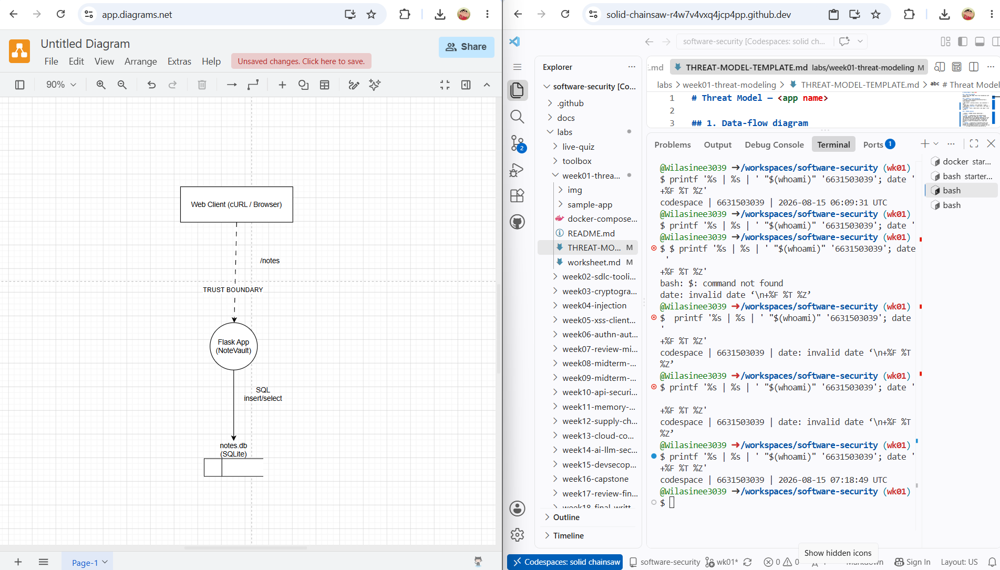

# Worksheet 1 — Security Mindset & Threat Modeling (3 hrs)
Course: Software Security (KOSEN69) · Week 1
Aligned to: OWASP 2025 A06 Insecure Design · CWE-501 (Trust Boundary Violation)
Signature game: "Elevation of Privilege" (Microsoft STRIDE card deck)

Ethics note: This worksheet is for modeling and defensive verification on the provided local lab only. Testing is performed only on the student's own VM/localhost and authorized project environment.

> **Course:** Software Security (KOSEN69) · **Week 1**
> **Aligned to:** OWASP 2025 A06 Insecure Design · CWE-501 (Trust Boundary Violation)
> **Signature game:** "Elevation of Privilege" (Microsoft STRIDE card deck)

> **Ethics note:** This week is *modeling only* — you analyze design, you do **not** attack the app. Run the sample app only on your own VM/localhost. Never apply these techniques to systems you do not own or lack written permission to test.

| Name | Student ID | Date | Group |
|---|---|---|---|
| Wilasinee Mangkorn | 6631503039 | 15/08/2026 | |

## Part 2 — Lecture Questions
Answer in your own words (2–4 sentences each).
1. Define the CIA triad and give one concrete failure example for each of the three properties.
2. What is a *trust boundary*, and why does data crossing one deserve extra scrutiny?
3. Explain "attack surface." Name two things that increase it in a web app.
4. What does each STRIDE letter map to, and which security property does each threat violate?
5. What does "Secure by Design" (CISA) mean, and how does it differ from bolting security on after release?

## Part 3 — Hands-on Lab (180 min)
**Learning goals:** build a data-flow diagram (DFD), apply STRIDE to a real Flask app, rank risks, and propose mitigations.
**Prerequisites:** Docker + Docker Compose in your VM; a drawing tool (draw.io / paper + photo); the Elevation of Privilege deck (print or virtual) — free print-and-play PDF at [github.com/adamshostack/eop](https://github.com/adamshostack/eop).

**Environment setup**
```bash
cd labs/week01-threat-modeling
docker compose up --build           # starts sample-app on http://localhost:8080
curl -s -X POST localhost:8080/notes -H 'Content-Type: application/json' \
     -d '{"owner":"alice","body":"hello"}'   # observe behavior, do not attack
curl -s localhost:8080/notes

echo "demo file" > demo.txt
curl -s -X POST localhost:8080/upload -F "file=@demo.txt"   # observe behavior, do not attack
curl -s localhost:8080/files/demo.txt
```

Source to model lives in `sample-app/app.py`. Template to fill: `THREAT-MODEL-TEMPLATE.md` (copy it, do not edit the original).

**What to submit per task:** the threat/element identified + a screenshot (DFD, table, or running app) + a 2–3 sentence mitigation.

**Task 0 — Onboarding (5 min)** · *Goal:* prove the environment works. *Steps:* `docker compose up`, hit `/notes` and `/files/<name>`, read `sample-app/app.py`. *Deliverable:* .

**Task 1 — Draw the DFD (25 min)** · *Goal:* map the system. *Steps:* identify the external entity (web client), the process (Flask app), the data store (`notes.db` SQLite), the `uploads/` store, and the flows for `/notes`, `/upload`, `/files/<name>`; mark the Internet→app trust boundary with a dashed line. *Deliverable:* .

**Task 2 — STRIDE the elements (30 min)** · *Goal:* enumerate threats per element. *Steps:* for each element fill the S/T/R/I/D/E grid. Ground it in real code: `/notes` accepts a client-supplied `owner` with no auth (Spoofing); `/upload` saves raw `f.filename` — arbitrary-file-write (Tampering) — and echoes the resolved save path back in its response (Information disclosure); `/files/<name>` reads it back but is comparatively defended (see Task 5); no logging anywhere (Repudiation). *Deliverable:* completed STRIDE table.

### Task 3 — Elevation of Privilege game

**Carded Threats & Score:**
1. **Card: 5 of Spades (Spoofing)** - *Threat:* An attacker can spoof an identity because there is no authentication. *Mapped to:* The `/notes` endpoint allows anyone to set the `owner` JSON field directly.
2. **Card: 8 of Clubs (Tampering)** - *Threat:* An attacker can manipulate a filename to overwrite unintended files. *Mapped to:* The `/upload` endpoint trusts `f.filename` without sanitization.
3. **Card: 3 of Hearts (Information Disclosure)** - *Threat:* The system reveals internal file paths or sensitive data. *Mapped to:* The `/files/<name>` endpoint can leak backend system files if path traversal is exploited.
**Total Score:** 3 points.

### Task 3b — Systems-level pass
*   **Trust boundaries end-to-end:** A request flows from Web Client ➔ (Internet Boundary) ➔ Flask App ➔ (Process Boundary) ➔ SQLite DB. The crossing with **no check on it** is the Internet ➔ Flask App boundary (the `/notes` endpoint lacks authentication).
*   **Assume one element is fully owned:**
    1.  *Flask process:* Attacker reaches the entire `notes.db` and can read/write to the host's file system.
    2.  *uploads/ store:* Attacker can replace legitimate files with executable scripts, potentially reaching other users' local machines when downloaded.
*   **Chain two "low" findings:** Missing rate limiting (Minor DoS) ➔ Unauthenticated file upload (Tampering) ➔ **Consequence:** Attacker rapidly uploads large junk files, exhausting disk space and crashing the app.
*   **One-line system claim:** "Even if every element-level mitigation in Task 8 is implemented, this system still fails if **the Flask application is run with root/administrator privileges on the host OS**."

---

## 🧠 Comprehension & Prompt (required)

**A. Explain in Plain English (EiPE).** In 2–3 sentences, in your own words, describe what this week's vulnerable code/endpoint actually *does* and *why it is exploitable* — explain the mechanism, don't dump jargon.

**B. Prompt Problem.** Write a **single prompt** that makes an AI produce a *correct, secure* fix for one finding. Run it: does the exploit now fail? If not, refine the prompt and try again. Submit the **final prompt + the verified result**.
*Graded on the prompt's precision and your verification — this trains problem decomposition and AI literacy (Denny et al. 2024).*

### Task 4 — Abuse cases & attacker personas

**Persona 1: Anonymous Internet Attacker** (Goal: Compromise the server or cause disruption)
*   **Abuse Case 1 (Elevation of Privilege):** The attacker uploads a malicious `.sh` or `.py` file to `/upload` using a path traversal payload (`../../`) to overwrite a system binary or place a backdoor in an executable path, aiming to gain full Remote Code Execution (RCE).
*   **Abuse Case 2 (Denial of Service):** The attacker writes a script to continuously send multi-gigabyte junk files to the `/upload` endpoint until the server's disk space is completely exhausted, causing the application to crash for legitimate users.

**Persona 2: Malicious User / Troll** (Goal: Defame others or steal information)
*   **Abuse Case 3 (Spoofing):** The attacker sends a POST request to `/notes` with the `owner` field set to the admin's name, inserting fake or offensive messages into the database to ruin the admin's reputation.
*   **Abuse Case 4 (Information Disclosure):** The attacker attempts to read internal server files by guessing system file names (e.g., `config.py` or `.env`) via the `/files/<name>` endpoint.

---

### Task 5 — Path-traversal deep-dive

**1. Data Flow Trace (`/upload` → `/files/<name>`):**
*   **Attacker** sends HTTP POST to `/upload` with file attachment and a manipulated filename (e.g., `filename="../../../etc/shadow"`).
*   **Flask App** receives the payload. Without sanitization, it concatenates the base upload directory with the raw filename: `uploads/../../../etc/shadow`.
*   **Operating System** interprets `../` as "move up one directory". It escapes the `uploads/` folder and writes the file to the root system directory.

**2. Secure Design Note:**
To prevent this, the application must employ defense-in-depth:
1.  **Sanitization:** Pass the user-supplied filename through `werkzeug.utils.secure_filename()` to strip out all `../` and `/` characters before saving.
2.  **Allow-listing:** Strictly validate the file extension against a safe list (e.g., only `.txt`, `.png`).
3.  **Storage:** Store uploaded files in a directory located *outside* the application's web root to prevent direct execution of uploaded scripts.

### Task 6 — Threat-model the project target

**()**

**Top 3 STRIDE Threats for NoteVault:**
1. **Spoofing:** The application might allow unauthenticated access to the notes API, enabling anyone to view or modify notes if proper session management or token validation is not strictly enforced.
2. **Information Disclosure (IDOR):** If the application uses predictable sequential IDs for notes without verifying ownership (Authorization check) on each request, User A might be able to read User B's private notes simply by changing the ID in the URL.
3. **Tampering (Cross-Site Scripting - XSS):** If the application accepts rich text or markdown for note bodies but fails to sanitize the input before rendering it in the browser, an attacker could store a malicious script in a note that executes when another user views it.

---

### Task 7 — Security requirements

1. **Mitigating Spoofing (Authentication):**
   * *Requirement:* The system must authenticate all requests to the `/notes` API by validating a secure session token or JWT, so that attackers cannot spoof the `owner` identity in the payload.
2. **Mitigating Tampering (Path Traversal/Uploads):**
   * *Requirement:* The system must sanitize all uploaded file names using `werkzeug.utils.secure_filename()` and strictly validate extensions against an allow-list, so that attackers cannot write files outside the designated `uploads/` directory.
3. **Mitigating Information Disclosure (Authorization/IDOR):**
   * *Requirement:* The system must enforce authorization checks on every data retrieval endpoint, verifying that the authenticated user's ID matches the owner ID of the requested note, so that users can only access their own data.

   
### Task 8 — Defend / fix it: rank & mitigate

**Top 5 Threats Ranked (Likelihood × Impact):**
1. **Tampering / Path Traversal (`/upload`):** High risk. Attacker can write arbitrary files to the server. *Mitigation:* Use `secure_filename()` and validate extensions against an allowlist.
2. **Spoofing (`/notes`):** High risk. Anyone can post as any owner. *Mitigation:* Implement strict authentication (e.g., JWT or Session tokens) for the POST endpoint.
3. **Information Disclosure (`/files/<name>`):** Medium risk. Exposes internal files if traversed. *Mitigation:* Store uploads outside the web root and serve via a secure controller.
4. **Denial of Service (DoS on `/upload`):** Medium risk. Attackers can exhaust disk space. *Mitigation:* Enforce strict file size limits and rate limiting on the upload endpoint.
5. **Repudiation (System-wide):** Low-Medium risk. No actions are logged. *Mitigation:* Implement centralized application logging for all state-changing requests.

**Implemented Mitigation Evidence:**
*   **The diff:** Added `from werkzeug.utils import secure_filename` and wrapped `f.filename` with `secure_filename()` before saving.
*   **Evidence it works:** As shown in the screenshot, the payload `../../../etc/hacked.txt` was successfully neutralized and saved safely as `etc_hacked.txt` within the designated uploads folder.
*   **Class vs. Instance fix:** This is an **instance fix** because it only applies to this specific `/upload` endpoint. A **class fix** would involve a centralized storage module or framework-level middleware that completely prevents any user-supplied string from being used directly in file I/O operations across the entire application without passing through a sanitization pipeline.


## Part 4 — Reflection

1. **Map finding to CWE/OWASP:** 
   The Path Traversal vulnerability in the `/upload` endpoint maps to **CWE-22 (Improper Limitation of a Pathname to a Restricted Directory)** and **OWASP A06 (Insecure Design)**, because the system was designed to implicitly trust user-supplied input for file paths without a defense mechanism.
2. **Real-world breach:** 
   The 2021 Apache HTTP Server path traversal attack (CVE-2021-41773) allowed attackers to map URLs to files outside the expected document root. A "Secure by Design" control that strictly normalizes and validates all file paths against a strict allowlist before accessing the file system would have prevented this.
3. **Best Mitigation:** 
   Using `secure_filename()` combined with storing uploaded files completely outside the web root provides the most risk reduction per unit of effort. It effectively kills the entire class of path traversal vulnerabilities with just one or two lines of code, without requiring complex architecture changes.

---

## 🤖 Audit the AI (required)

**1. Ask an AI to fix:**
*Prompt:* "How do I fix a path traversal vulnerability in Flask file uploads?"
*AI's answer (simulated):* "You can fix it by removing the `../` characters from the filename before saving. Use this code: 
`safe_name = f.filename.replace('../', '')`
`f.save(os.path.join(UPLOAD_DIR, safe_name))`"

**2. Find what's wrong or risky:**
The AI's suggested fix is dangerously incomplete. The line `safe_name = f.filename.replace('../', '')` is vulnerable to bypass using nested payloads like `....//`. When the `replace` function removes the inner `../`, the remaining characters concatenate to form a new `../`, successfully traversing the directory again.

**3. Correct, verified version:**
```python
from werkzeug.utils import secure_filename
safe_name = secure_filename(f.filename)
f.save(os.path.join(UPLOAD_DIR, safe_name))