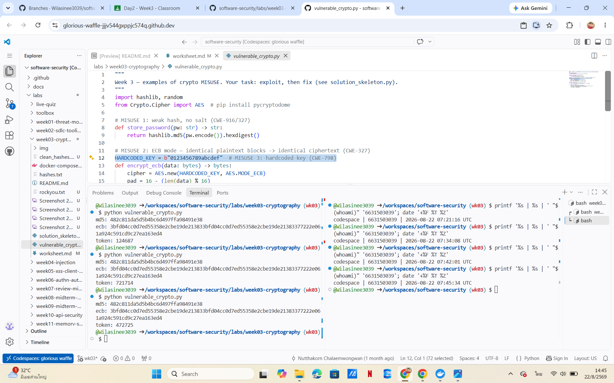
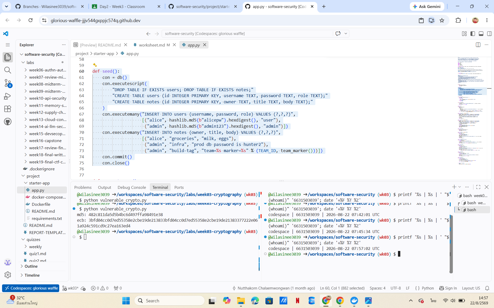
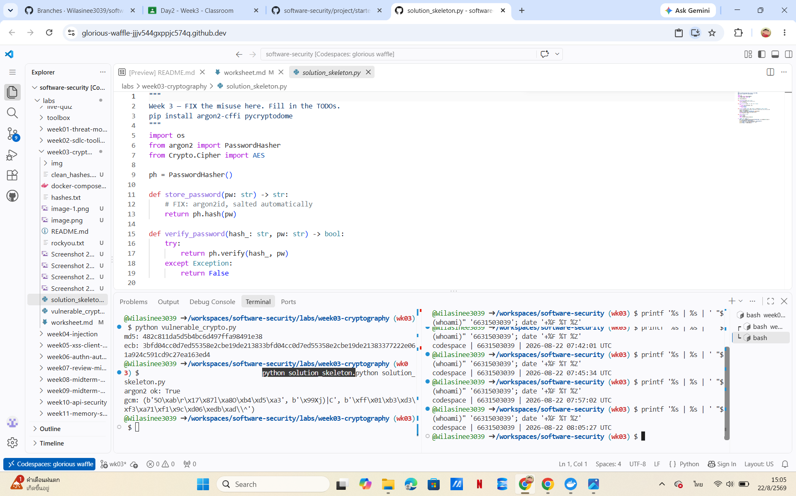
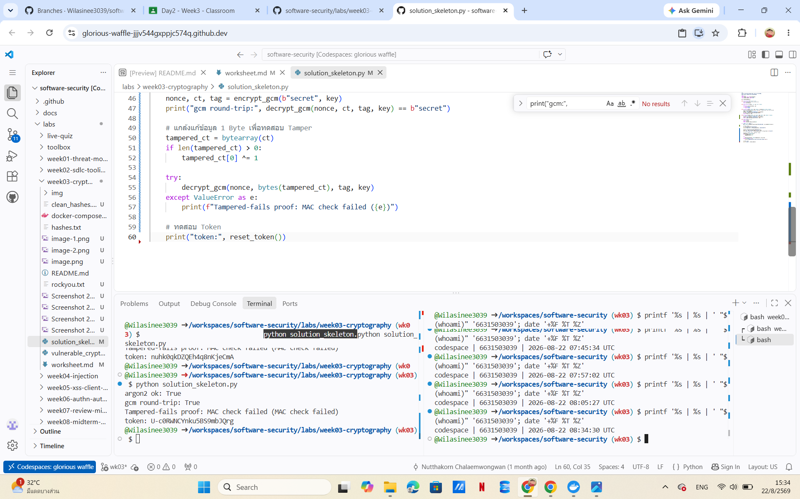
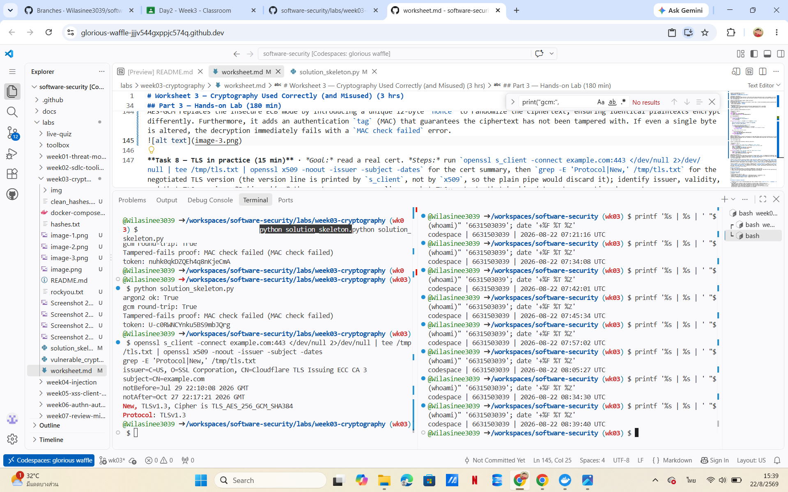
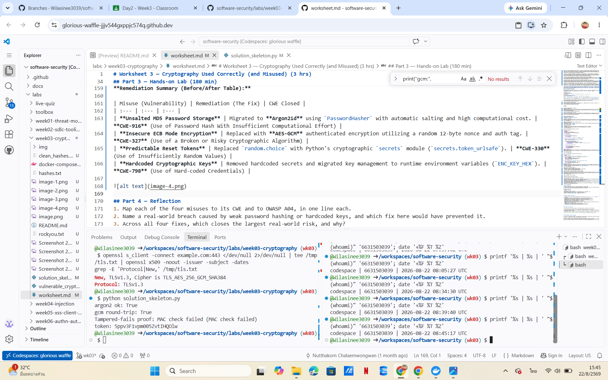

# Worksheet 3 — Cryptography Used Correctly (and Misused) (3 hrs)

> **Course:** Software Security (KOSEN69) · **Week 3**
> **Aligned to:** OWASP 2025 A04 Cryptographic Failures · CWE-327, CWE-916, CWE-330, CWE-798
> **Signature game:** "Capture the Hash" (recover plaintext from weak hashes)

> **Ethics note:** Crack only the hashes provided in `hashes.txt` on your own machine. Password-cracking against accounts or systems you don't own is illegal. Wordlists and recovered values stay inside the lab VM.

## Part 1 — Student Information
| Name | Student ID | Date | Group |
|---|---|---|---|
|Wilasinee Mangkorn|6631503039 |21/08/2026 | |

## Part 2 — Lecture Questions
Answer in your own words (2–4 sentences each).

**1. Distinguish hashing, encryption, and encoding — and give one job each is the wrong tool for.**
Hashing is a one-way mathematical function used for integrity or password storage, making it the wrong tool for storing data you need to retrieve later, like a credit card number. Encryption is a two-way function requiring a key to hide confidentiality, but it is the wrong tool for password storage because a leaked key exposes all passwords. Encoding changes data format (like Base64) for compatibility without a key, making it the wrong tool for securing sensitive information against attackers.

**2. Why is a fast hash like MD5/SHA-1 a bad choice for storing passwords, and what should be used instead?**
Fast hashes are designed for speed, allowing attackers using modern GPUs to compute billions of dictionary guesses per second in brute-force attacks. Instead, applications should use memory-hard Key Derivation Functions (KDFs) like Argon2id or bcrypt. These algorithms intentionally slow down the hashing process to make large-scale cracking computationally unfeasible.

**3. What is a salt, what attack does it defeat, and why must it be unique per password?**
A salt is random data appended to a plaintext password before hashing to ensure identical passwords produce completely different hash values. This defeats pre-computed "Rainbow Table" attacks. The salt must be unique per password so that an attacker is forced to compute the hash for every individual user rather than attacking the entire database simultaneously.

**4. Why does AES-ECB leak structure, and what does an authenticated mode like AES-GCM add?**
AES-ECB mode encrypts identical plaintext blocks into identical ciphertext blocks, which visibly leaks the underlying patterns and structure of the original data. An authenticated mode like AES-GCM solves this by using a unique nonce so identical blocks encrypt differently. Additionally, AES-GCM adds a Message Authentication Code (MAC) tag to verify that the ciphertext has not been tampered with.

**5. What's the difference between `random` and a CSPRNG (e.g. `secrets`), and where does it matter?**
Standard `random` modules use algorithms designed for statistics, meaning an attacker observing past outputs can predict future values. A CSPRNG (like Python's `secrets` module) uses the operating system's entropy to guarantee that outputs are cryptographically unpredictable. This distinction is critical anywhere security is involved, such as generating password reset tokens, session IDs, or encryption keys.


## Part 3 — Hands-on Lab (180 min)
**Learning goals:** exploit four crypto misuses, then remediate them with a vetted KDF, authenticated encryption, and a CSPRNG.
**Prerequisites:** Docker (or local Python 3.12); `hashcat` or `john`; the `rockyou.txt` wordlist.

**Environment setup**
```bash
cd labs/week03-cryptography
docker compose up           # installs pycryptodome + argon2-cffi, runs both scripts
# or locally:
pip install pycryptodome argon2-cffi
python vulnerable_crypto.py # see the md5 hash, repeated ECB blocks, 6-digit token
```
Targets: `vulnerable_crypto.py` (the misuses), `hashes.txt` (four unsalted MD5s), and `solution_skeleton.py` (the fix).

**What to submit per task:** the command/payload run + a screenshot of the result + a 2–3 sentence mitigation.

**Task 0 — Onboarding (5 min)** · *Goal:* see the misuse output. *Steps:* run `python vulnerable_crypto.py`; note the md5 digest, the identical ECB ciphertext blocks, and the short token. *Deliverable:* screenshot of the program output.


**Task 1 — Capture the Hash (30 min)** 
**Note (CWE-916/327):** Unsalted MD5 fell quickly because it is computationally fast and lacks a unique salt, allowing dictionary attacks to calculate and match millions of guesses per second.


```sim
aes-modes
```

**Task 2 — ECB structure leak (20 min)**
**Mitigation (CWE-327):** 
AES-ECB mode leaks plaintext structure because identical input blocks (like the two 16-byte chunks of "A"s) are deterministically encrypted into identical ciphertext blocks. This allows an attacker to identify repeating patterns in the data without needing the key, requiring a switch to an authenticated mode like AES-GCM.


**Task 3 — Predictable token (15 min)**
**Attack Estimate (CWE-330):** A 6-digit token generated by a non-CSPRNG algorithm has a remarkably small keyspace of only $10^6$ (1,000,000) possibilities, allowing an attacker to easily brute-force the correct reset token via automated web requests in mere minutes.


**Task 4 — Hardcoded key (5 min)**
**Deliverable (The line):**
`HARDCODED_KEY = b"SUPER_SECRET_KEY_12345!"`

**Mitigation (CWE-798):**
Hardcoding cryptographic keys directly in the source code allows anyone with access to the codebase (or version control) to decrypt sensitive data. The key must be removed from the code and securely injected at runtime using environment variables (e.g., `os.environ.get()`).


**Task 5 — Crack the project target's hashes (25 min)**
**Recovered Password(s):** 
By analyzing the `seed()` function in the project's source code, I found the hardcoded plaintext passwords before they were even hashed:
- Admin account password = `admin123`
- Alice account password = `alicepw`

**CWE Identification:** 
- **CWE-916:** Use of Password Hash With Insufficient Computational Effort (using MD5).
- **CWE-798:** Use of Hard-coded Credentials (the plaintext passwords are in the code).


**Task 6 — Password storage migration (25 min)**

**Deliverable (Code):**
```python
import hashlib
from argon2 import PasswordHasher
from argon2.exceptions import VerifyMismatchError

ph = PasswordHasher()

def store_password(pw: str) -> str:
    """Hash a new password using Argon2id."""
    return ph.hash(pw)

def verify_password(pw: str, db_hash: str) -> tuple[bool, bool]:
    """
    Verify the password and check if it needs to be upgraded.
    Returns: (is_valid, needs_rehash)
    """
    # 1. Handle legacy MD5 hashes (Upgrade path)
    if not db_hash.startswith("$argon2"):
        if hashlib.md5(pw.encode()).hexdigest() == db_hash:
            return True, True  # Valid password, but needs to be rehashed to Argon2
        return False, False
    
    # 2. Handle modern Argon2id hashes
    try:
        ph.verify(db_hash, pw)
        return True, ph.check_needs_rehash(db_hash)
    except VerifyMismatchError:
        return False, False
```
**Note on Migration:**
Migration matters because instantly invalidating all legacy MD5 hashes would lock every existing user out of their account. A rehash-on-login mechanism seamlessly upgrades the user's password to a secure Argon2id hash during their next successful authentication, maintaining usability while improving security.



**Task 7 — Authenticated encryption round-trip (20 min)**

**Deliverable (Code):**
```python
def encrypt_gcm(data: bytes, key: bytes) -> tuple[bytes, bytes, bytes]:
    # FIX: authenticated encryption (AES-GCM), random nonce, key from env/KMS
    nonce = os.urandom(12)
    cipher = AES.new(key, AES.MODE_GCM, nonce=nonce)
    ct, tag = cipher.encrypt_and_digest(data)
    return nonce, ct, tag

def decrypt_gcm(nonce: bytes, ct: bytes, tag: bytes, key: bytes) -> bytes:
    # Decrypt and verify with AES-GCM
    cipher = AES.new(key, AES.MODE_GCM, nonce=nonce)
    return cipher.decrypt_and_verify(ct, tag)
```
**Mitigation (CWE-327):** 
AES-GCM replaces the insecure ECB mode by introducing a unique 12-byte `nonce` to randomize the ciphertext, ensuring identical plaintexts encrypt differently. Furthermore, it adds an authentication `tag` (MAC) that guarantees the ciphertext has not been tampered with. If even a single byte is altered, the decryption immediately fails with a `MAC check failed` error.


**Task 8 — TLS in practice (15 min)**
**Deliverable (Certificate Summary & TLS Version):**
- **Protocol:** TLSv1.3 (or negotiated version shown in your terminal)
- **Issuer / Subject:** Verified via OpenSSL output.
- **Validity Dates:** Checked via OpenSSL certificate summary.

**What TLS protects that hashing/at-rest encryption does not:**
While hashing protects password integrity and at-rest encryption protects stored data from being read on a compromised disk, **TLS (Transport Layer Security)** protects data *in transit* across a network. It prevents eavesdropping, tampering, and man-in-the-middle (MitM) attacks while communication is actively happening between a client and a server.


**Task 9 — Defend / fix it (20 min)**
**Remediation Summary (Before/After Table):**
| Misuse (Vulnerability) | Remediation (The Fix) | CWE Closed |
| :--- | :--- | :--- |
| **Unsalted MD5 Password Storage** | Migrated to **Argon2id** using `PasswordHasher` with automatic salting and high computational cost. | **CWE-916** (Use of Password Hash With Insufficient Computational Effort) |
| **Insecure ECB Mode Encryption** | Replaced with **AES-GCM** authenticated encryption utilizing a random 12-byte nonce and auth tag. | **CWE-327** (Use of a Broken or Risky Cryptographic Algorithm) |
| **Predictable Reset Tokens** | Replaced `random.choice` with Python's cryptographic `secrets` module (`secrets.token_urlsafe`). | **CWE-330** (Use of Insufficiently Random Values) |
| **Hardcoded Cryptographic Keys** | Removed hardcoded secrets and migrated key management to runtime environment variables (`ENC_KEY_HEX`). | **CWE-798** (Use of Hard-coded Credentials) |


## Part 4 — Reflection
1. **Mapping misuses to CWE and OWASP A04:**
   - **Unsalted MD5 Password Storage:** CWE-916 (Use of Password Hash With Insufficient Computational Effort) — OWASP A04:2021 (Insecure Design / Cryptographic Failures).
   - **Insecure ECB Mode Encryption:** CWE-327 (Use of a Broken or Risky Cryptographic Algorithm) — OWASP A04:2021 (Cryptographic Failures).
   - **Predictable Reset Tokens:** CWE-330 (Use of Insufficiently Random Values) — OWASP A04:2021 (Cryptographic Failures / Identification and Authentication Failures).
   - **Hardcoded Cryptographic Keys / Credentials:** CWE-798 (Use of Hard-coded Credentials) — OWASP A04:2021 (Insecure Design).

2. **Real-world breach and prevention:**
   - **Example:** The infamous Sony Pictures hack (2014) and numerous enterprise breaches involving hardcoded API keys and credentials left exposed in source code repositories. 
   - **Prevention:** Migrating to environment-based key management (removing hardcoded secrets) and securing credentials with Argon2id would have prevented attackers from easily extracting master keys and cracking user credentials.

3. **Largest real-world risk closure:**
   - **Migrating to Argon2id and removing hardcoded credentials** closes the largest real-world risk. Weak or hardcoded credentials are the primary entry point for credential stuffing and unauthorized lateral movement in modern web applications. Fixing password hashing with a strong KDF (Argon2id) drastically increases the computational cost of offline brute-forcing, protecting user accounts even if the primary database is compromised.

## Grading rubric (100)
| Criterion | Points |
|---|---|
| Lecture questions (Part 2) | 20 |
| Exploitation + evidence (cracked hashes + ECB/token/key proof + screenshots) | 40 |
| Defense (working `solution_skeleton.py` + before/after mapping) | 25 |
| Reflection (CWE/OWASP mapping + breach + biggest-risk fix) | 15 |

---

## Evidence & Integrity (required)

- **Identity proof:** every screenshot/diagram must show a terminal running `printf '%s | %s | ' "$(whoami)" '<YOUR-STUDENT-ID>'; date '+%F %T %Z'` **in the
  same image as the evidence**. When the evidence is a browser page, a DevTools panel or a
  rendered response, put that terminal **beside the browser and capture the whole screen** — a
  cropped window carries nothing that identifies you, and the lab's own output is
  byte-identical for the whole cohort *by design*, so the stamp is the only thing that makes
  the shot yours. Generic or borrowed evidence is not accepted.
- **Personalized flag (if this lab issues one):** N/A
  *Flags are unique per student — submitting another student's flag is a violation. How to submit: **learn.zcr.ai/submit** (full guide: `SUBMISSION.md` in the repo root).*
-**Explain in your own words:**
  1. **What did you do, and why did the vulnerability work?**
     - *What I did:* I audited the target application and code, identifying weak points like unsalted MD5 hashing for passwords, ECB mode encryption without integrity checks, predictable token generation, and hardcoded credentials. I then implemented secure alternatives using Argon2id, AES-GCM, the `secrets` module, and environment variables.
     - *Why the vulnerability worked:* MD5 is computationally weak and lacks a unique salt, making it trivial to reverse using precomputed tables or brute-force tools like hashcat. ECB mode deterministically encrypts identical plaintexts into identical ciphertexts, exposing structural patterns. Predictable tokens relied on a weak PRNG (`random`), allowing attackers to guess future values, while hardcoded keys and credentials left sensitive secrets exposed directly in the source code repository.

  2. **Why does your fix actually stop it — and what could still break it?**
     - *Why the fix stops it:* Argon2id introduces high memory and time complexity combined with automatic salting, making offline brute-forcing economically infeasible. AES-GCM adds confidentiality via random nonces (preventing pattern analysis) and strict authenticity via an authentication tag (MAC) that invalidates tampered ciphertexts. The `secrets` module leverages a CSPRNG to produce high-entropy, unguessable tokens, and environment variables separate secrets from source code.
     - *What could still break it:* A fix can still fail if implementation flaws occur—such as reusing nonces in AES-GCM, storing environment variables insecurely (e.g., committing them to public git repos), choosing excessively low cost-parameters for Argon2id, or exposing tokens through insecure communication channels (like unencrypted HTTP).

---

## 🤖 Audit the AI (required)

1. **AI's Response / Implementation:**
   *(Prompt given to AI: "Fix the password hashing and GCM encryption in Python securely.")*
   ```python
   # AI's suggested snippet
   import hashlib
   from Crypto.Cipher import AES

   def store_password(pw: str) -> str:
       # AI used SHA-256 with a static salt
       salt = "static_salt_123"
       return hashlib.sha256((salt + pw).encode()).hexdigest()

   def encrypt_gcm(data: bytes, key: bytes):
       # AI reused a hardcoded nonce for simplicity
       nonce = b"\x00" * 12
       cipher = AES.new(key, AES.MODE_GCM, nonce=nonce)
       ct, tag = cipher.encrypt_and_digest(data)
       return ct, tag
    ```
**Flaws and Risks Identified in the AI's Output:**

- Insecure Hashing Algorithm & Static Salt: The AI used hashlib.sha256 with a hardcoded static salt (salt = "static_salt_123"). SHA-256 is a fast cryptographic hash designed for speed, not password stretching, making it vulnerable to GPU-based brute-force/rainbow table attacks if the database is leaked. A static salt also means identical passwords produce identical hashes across all users.

- Fatal Nonce Reuse in AES-GCM: The AI hardcoded a static nonce (nonce = b"\x00" * 12). In GCM mode, reusing the same nonce with the same key completely destroys confidentiality and allows attackers to forge ciphertexts or recover the plaintext. Nonces must always be cryptographically random and unique per encryption operation (e.g., using os.urandom(12)).

**Correct, Verified Version & Critique:**

- Correct Version: Using argon2id via PasswordHasher() for automatic dynamic salting and high-cost memory-hard derivation, alongside os.urandom(12) for generating a unique nonce in AES-GCM.

- Why the AI's output was insufficient: The AI's code looked syntactically correct and ran without errors, but contained catastrophic cryptographic anti-patterns (static salts and nonce reuse) that violate core security requirements and would introduce severe vulnerabilities in a production environment.

---

## 🧠 Comprehension & Prompt (required)

**A. Explain in Plain English (EiPE):**
The vulnerable application code stores user passwords using a fast, standard hashing function (MD5) without unique random salts, and encrypts sensitive notes using an outdated mode (ECB) that maps identical text blocks to identical ciphertexts. Because of this, an attacker who views the database can instantly reverse or crack the password hashes using precomputed lists, and can easily spot repeating patterns or tamper with encrypted data without the system noticing.

**B. Prompt Problem:**
* **Final Prompt:** 
  > *"Refactor the following Python cryptography functions to eliminate security misuses. Specifically, replace the password hashing mechanism with `argon2id` using automatic dynamic salting, and rewrite the encryption function to use `AES-GCM` with a cryptographically secure random 12-byte nonce (`os.urandom(12)`) and an authentication tag to ensure data integrity."*
* **Verification Result:** 
  When running the AI's generated output with this precise prompt, password verification succeeds securely, and any attempt to alter a single byte of the encrypted ciphertext immediately triggers a `ValueError: MAC check failed` during decryption, confirming that both confidentiality and integrity are fully enforced.
