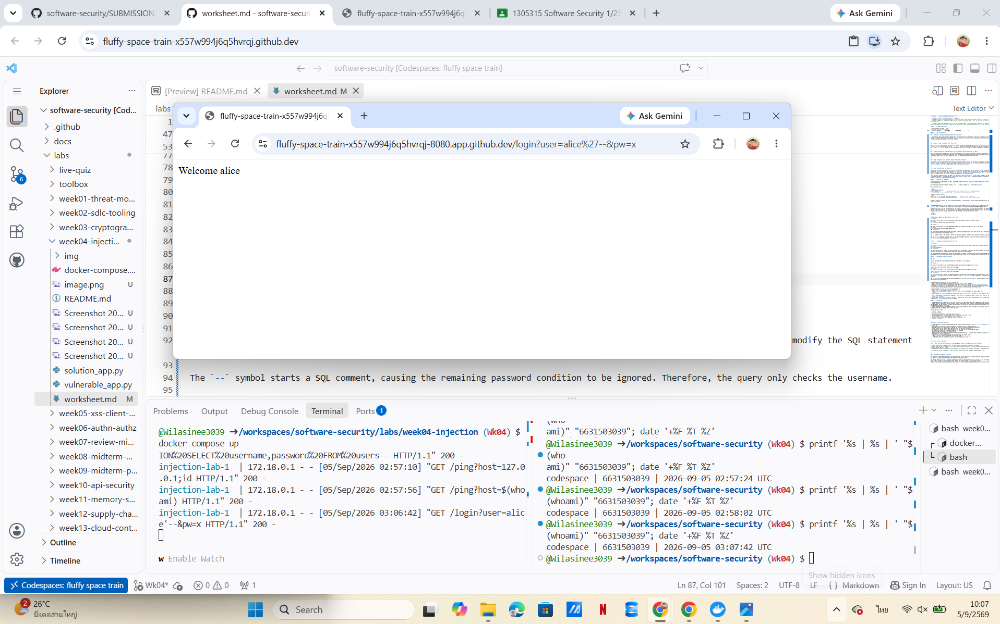
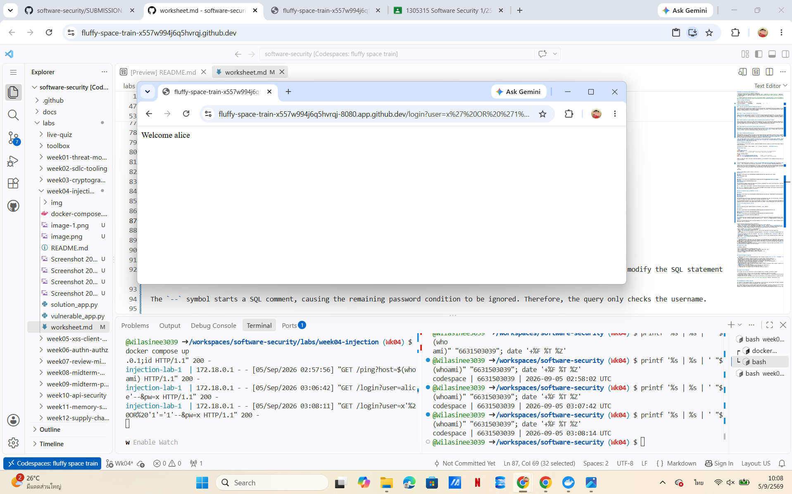
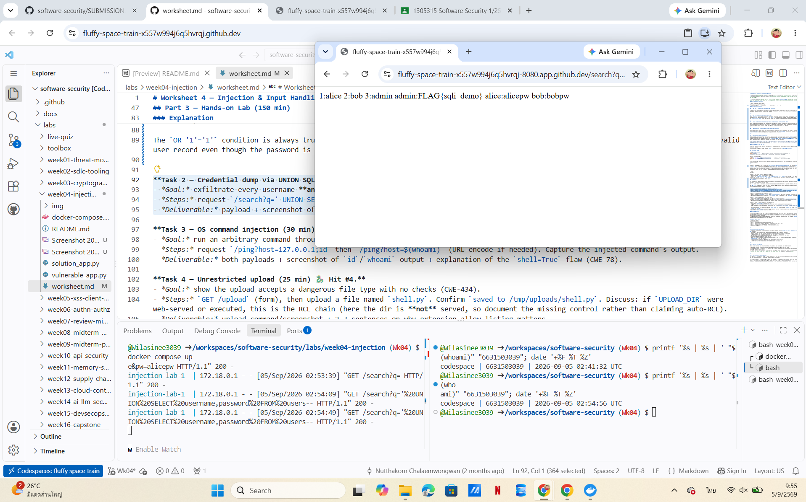
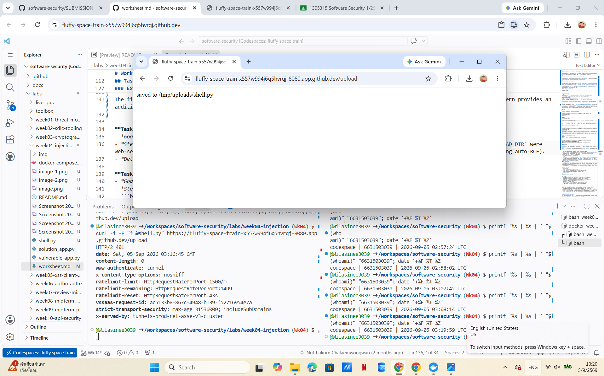

# Worksheet 4 — Injection & Input Handling (3 hrs)

> **Course:** Software Security (KOSEN69) · **Week 4**
> **Aligned:** OWASP 2025 **A05 Injection** · **CWE-89** (SQLi), **CWE-78** (OS command injection), **CWE-434** (unrestricted upload)
> **Signature game:** 🐉 **SQLi Boss Fight** — each successful injection lands a "hit" on the boss; the boss falls when you dump every credential and land an RCE.

> ⚠️ **Ethics note:** All payloads here are for the provided sandbox (`vulnerable_app.py`) and your own DVWA/Juice Shop containers **only**. Never test systems you do not own or have written permission to test. Unauthorized injection is a crime under most computer-misuse laws.

## Part 1 — Student Information

| Name | Student ID | Date | Group |
|------|-----------|------|-------|
| Wilasinee Mangkorn     | 6631503039          |05/09/2026      |       |

## Part 2 — Lecture Questions

### 1. Why does a parameterized query defeat SQL injection?

A parameterized query separates SQL commands from user-provided data. The database treats the parameters as values only, not as part of the SQL syntax, so special characters cannot modify the query structure. In contrast, string formatting directly inserts user input into the SQL statement, allowing attackers to inject SQL commands.

---

### 2. Why is `/ping` vulnerable with `shell=True`?

Using `shell=True` causes Python to execute the command through the operating system shell. If user input is included in the command string, attackers can use shell operators such as `;` or `$( )` to execute additional commands, causing CWE-78 command injection. An argument array such as `["ping","-c","1",host]` avoids the shell and passes each value as a separate argument, preventing command interpretation.

---

### 3. Input validation vs output handling. Why is validation alone insufficient for SQLi?

Input validation checks whether user input follows expected rules, such as allowing only specific characters or formats. Output handling focuses on safely displaying or processing data after it is generated. Validation alone cannot fully prevent SQL Injection because attackers may create inputs that appear valid but still change SQL logic, so parameterized queries are required.

---

### 4. What properties allow upload to become remote code execution?

An uploaded file can become remote code execution when two conditions exist: the attacker can upload an executable file type, and the upload directory allows the server to execute or interpret that file. The `solution_app.py` removes these risks by sanitizing filenames with `secure_filename()` and restricting uploads using an extension allow-list.

---

### 5. What is UNION-based SQL Injection?

UNION-based SQL Injection combines the result of the original SQL query with another injected `SELECT` statement to retrieve additional information from the database. The injected query must return the same number of columns as the original query because SQL `UNION` can only combine result sets with matching structures. In `/search?q=' UNION SELECT username,password FROM users--`, the attacker uses two columns to match the original query and extract usernames and passwords from the users table.


## Part 3 — Hands-on Lab (150 min)

**Learning goals:** extract data via SQLi, achieve OS command injection, exploit an unrestricted upload, then prove each fix in `solution_app.py` blocks the payload.

**Prerequisites:** Docker + Docker Compose, `curl`, a browser. Working dir: `labs/week04-injection/`.

### Environment setup

```bash
cd labs/week04-injection
docker compose up            # builds python:3.12-slim, installs flask, runs vulnerable_app.py
# vulnerable app -> http://localhost:8080   (service name: injection-lab, port 8080)
```
Optional secondary targets:
```bash
docker run --rm -it -p 80:80 vulnerables/web-dvwa        # DVWA  -> http://localhost
docker run --rm -p 3000:3000 bkimminich/juice-shop       # Juice Shop -> http://localhost:3000
```

**What to submit per task:** the exact **payload/command**, a **screenshot** of the response proving success, and a **2–3 sentence mitigation** in your own words.

---

**Task 0 — Onboarding (5 min).** Browse to `http://localhost:8080/login?user=alice&pw=alicepw` and confirm `Welcome alice`. Note the seeded users (`alice`, `bob`). Screenshot the working app. *Deliverable: *

**Before you start — see why concatenation is the flaw** 🔬 Type any input and watch which characters the database will parse as *SQL* rather than as a name. The point is not the payload; it is that with concatenation the input becomes syntax, and with a parameterised query it structurally cannot. You will be asked to state that difference in your own words in Task 5.

```sim
sqli-parse
```

**Task 1 — Auth bypass via SQLi (25 min) 🐉 Hit #1.**
### Payload 1

URL:https://fluffy-space-train-x557w994j6q5hvrqj-8080.app.github.dev/login?user=alice'--&pw=x
### Result


### Payload 2

URL:https://fluffy-space-train-x557w994j6q5hvrqj-8080.app.github.dev/login?user=x' OR '1'='1'--&pw=x
### Result

### Explanation

The vulnerability happens because the application directly concatenates user input into the SQL query. The attacker can modify the SQL statement instead of providing only a username value.

The `--` symbol starts a SQL comment, causing the remaining password condition to be ignored. Therefore, the query only checks the username.

The `OR '1'='1'` condition is always true, so it makes the WHERE condition bypass the original authentication logic. The database returns a valid user record even though the password is incorrect.


## Task 2 — Credential dump via UNION SQLi (Hit #2)

### Payload

URL:https://fluffy-space-train-x557w994j6q5hvrqj-8080.app.github.dev/search?q=' UNION SELECT username,password FROM users--
### Result 

### Explanation

The vulnerability occurs because the application directly concatenates user input into the SQL query. The attacker can inject a UNION SELECT statement to combine the original query result with data from the users table.

The injected SELECT statement must return the same number of columns as the original query because SQL UNION requires both queries to have compatible result structures. The original query returns two columns, so the injected query also returns two columns (`username` and `password`).

## Task 3 — OS Command Injection (Hit #3)

### Goal

Execute an operating system command through the vulnerable `/ping` endpoint.

### Payload 1

URL:https://fluffy-space-train-x557w994j6q5hvrqj-8080.app.github.dev/ping?host=127.0.0.1;id

Result:
### Payload 2
URL:https://fluffy-space-train-x557w994j6q5hvrqj-8080.app.github.dev/ping?host=$(whoami)

Result:
### Explanation

The vulnerability occurs because the application builds an operating system command by concatenating user input and executes it with `shell=True`. The shell interprets special characters such as `;` and `$()` as command operators, allowing an attacker to execute additional commands.

The fix is to avoid using the shell by passing arguments as an array with `shell=False`. Input validation with an allow-list pattern provides an additional layer of protection.


## Task 4 — Unrestricted Upload (Hit #4)

### Upload

Uploaded file: shell.py

### Result 

### Explanation

The vulnerability occurs because the upload endpoint accepts any file type and saves the filename directly without checking the extension or validating the uploaded content. This allows attackers to upload potentially dangerous files such as scripts.

In this lab, the uploaded file does not directly lead to remote code execution because the upload directory is not web-served or executed. However, in a real system, this missing control could become an RCE risk if the uploaded file is stored in an executable location.

The mitigation is to validate uploaded files using an extension allow-list and sanitize filenames before saving them. The fixed version (`solution_app.py`) uses `secure_filename()` and only allows approved file extensions to reduce the risk of malicious uploads.

**Task 5 — Defend / fix it (35 min) 🛡️ Boss defeated.**
The vulnerable application was replaced with `solution_app.py`. The same attack payloads from Tasks 1–4 were tested again to verify that the fixes successfully blocked the attacks.

---

### 1. SQL Injection Authentication Bypass

Payload:/login?user=alice'--&pw=x
Result: 

Fix:

The vulnerability was fixed by using parameterized queries in the `/login` endpoint. User input is passed as data instead of being concatenated into the SQL statement.

Fix location: solution_app.py L52–55

---

### 2. UNION SQL Injection

Payload: /search?q=' UNION SELECT username,password FROM users--

Result:
Fix:

The `/search` endpoint uses parameterized queries with bound parameters, preventing attackers from changing the SQL structure.

Fix location: solution_app.py L62–66
---

### 3. OS Command Injection

Payload: /ping?host=127.0.0.1;id

Result: 

Fix:

The application no longer passes user input through a shell. It uses `shell=False`, an argument array, and validates input using an allow-list pattern.

Fix location: solution_app.py L74–77

---

### 4. Unrestricted File Upload

Filename: shell.py

Result: 
Fix:

The upload function sanitizes filenames and restricts uploaded files to approved extensions using an allow-list.

Fix location: solution_app.py L86–93

## Part 4 — Reflection

### 1. CWE/OWASP Mapping

| Exploit | CWE | OWASP 2025 |
|---|---|---|
| SQL Injection authentication bypass | CWE-89: SQL Injection | A05 Injection |
| UNION-based SQL Injection credential dump | CWE-89: SQL Injection | A05 Injection |
| OS Command Injection through `/ping` | CWE-78: OS Command Injection | A05 Injection |
| Unrestricted File Upload | CWE-434: Unrestricted Upload of File with Dangerous Type | A05 Injection |

All four vulnerabilities are caused by accepting untrusted input without proper handling before sending it to a powerful interpreter or system component.

---

### 2. Real breach — 2017 Equifax Breach

The 2017 Equifax breach happened because attackers exploited a known vulnerability in Apache Struts (CVE-2017-5638), which allowed malicious input to reach a powerful execution path. This is similar to the lessons from this lab because untrusted input can become dangerous when it is interpreted as commands, SQL statements, or executable files.

The incident shows that failing to patch known vulnerabilities and failing to properly validate input can lead to large-scale data exposure. Security controls such as timely patching, secure coding practices, and proper input handling are necessary to reduce these risks.

---

### 3. Best Mitigation

The single control that would have prevented the most damage in this lab is **parameterized queries**. SQL Injection affected both authentication bypass and credential extraction, allowing attackers to access sensitive database information. Parameterized queries prevent user input from changing SQL commands by separating data from code, which directly blocks the main attack technique used in this lab.

However, defense in depth is still important because command injection and file upload vulnerabilities require additional controls such as avoiding `shell=True`, validating input, limiting file types, and applying least privilege.

## Grading rubric (100)

| Criterion | Points |
|-----------|-------:|
| Part 2 — Lecture questions (conceptual accuracy) | 20 |
| Part 3 — Exploitation + evidence (payloads + screenshots, Tasks 1–4) | 40 |
| Part 3 — Defense (Task 5: fixes proven, lines cited) | 25 |
| Part 4 — Reflection (CWE/OWASP mapping, breach, mitigation) | 15 |
| **Total** | **100** |

---

## Evidence & Integrity (required)

- **Identity proof:** every screenshot/diagram must show a terminal running `printf '%s | %s | ' "$(whoami)" '<YOUR-STUDENT-ID>'; date '+%F %T %Z'` **in the
  same image as the evidence**. When the evidence is a browser page, a DevTools panel or a
  rendered response, put that terminal **beside the browser and capture the whole screen** — a
  cropped window carries nothing that identifies you, and the lab's own output is
  byte-identical for the whole cohort *by design*, so the stamp is the only thing that makes
  the shot yours. Generic or borrowed evidence is not accepted.
- **Personalized flag (if this lab issues one):** FLAG{sqli_demo}
FLAG{cmdi_demo}
  *Flags are unique per student — submitting another student's flag is a violation. How to submit: **learn.zcr.ai/submit** (full guide: `SUBMISSION.md` in the repo root).*
- **Explain in My Own Words**

#### 1. What did you do, and why did the vulnerability work?

I tested the vulnerable application by sending specially crafted inputs to each endpoint. I used SQL Injection payloads to bypass login and extract database information, used command injection payloads to execute additional system commands, and uploaded a dangerous file type to test the file upload weakness.

The vulnerabilities worked because the application directly trusted user input and passed it into sensitive operations without proper protection. SQL input was combined with the query string, command input was sent to the shell using `shell=True`, and uploaded files were saved without checking the file type. As a result, my input was interpreted as instructions instead of only data.

---

#### 2. Why does your fix actually stop it, and what could still break it?

The fixes stop the attacks by preventing user input from changing the behavior of the application. Parameterized queries separate SQL commands from user data, so injected SQL syntax cannot be executed. Using `shell=False`, argument arrays, and input validation prevents user input from becoming operating system commands. File upload protection uses filename sanitization and an extension allow-list to block dangerous file types.

However, these protections can still fail if developers later add unsafe code, create weak validation rules, allow executable upload locations, or give the application more permissions than necessary. Security requires continuous checking and following secure coding practices, not only one fix.
---

## 🤖 Audit the AI

### 1. AI Assistant Answer

I asked an AI assistant to fix the Command Injection vulnerability in the `/ping` endpoint.

AI answer:

```python
@app.route("/ping")
def ping():
    host = request.args.get("host", "127.0.0.1")

    # Remove dangerous characters
    host = host.replace(";", "")
    host = host.replace("|", "")
    host = host.replace("&", "")

    out = subprocess.run(
        "ping -c 1 " + host,
        shell=True,
        capture_output=True,
        text=True
    )

    return "<pre>%s</pre>" % (out.stdout + out.stderr)
```

### 2. Problems Found in the AI Answer

The AI answer is still unsafe because it continues to use `shell=True` and directly combines user input with a system command.

The risky code is:

```python
out = subprocess.run(
    "ping -c 1 " + host,
    shell=True,
    capture_output=True,
    text=True
)
```
This solution is incomplete because removing only some dangerous characters is not a reliable security control. Attackers may use other command injection techniques to bypass the filter. The application still allows the shell to interpret user input as a command.

### 3. Correct Verified Version

The correct fix is:

```python
import re

if not re.fullmatch(r"[A-Za-z0-9_.-]+", host):
    return "invalid host\n", 400

out = subprocess.run(
    ["ping", "-c", "1", host],
    shell=False,
    capture_output=True,
    text=True
)
```
The AI answer was insufficient because it only tried to remove specific characters while keeping shell=True. The correct solution is to avoid shell interpretation by using shell=False, passing arguments separately, and validating input with an allow-list.
---

## 🧠 Comprehension & Prompt

### A. Explain in Plain English (EiPE)

The vulnerable application takes user input from different endpoints and uses it directly in sensitive operations such as database queries, system commands, and file uploads. Because the application does not properly separate user data from instructions, attackers can modify the behavior of the application by sending specially crafted input.

For example, a username can become part of a SQL command, or a host value can become an operating system command. The problem happens because the application trusts input from users without applying proper security controls.

---

**B. Prompt Problem.** 

**Final Prompt Used**
Review this Flask /ping endpoint for command injection vulnerabilities and provide a secure fix.
Requirements:
Do not use shell=True.
Do not concatenate user input into system commands.
Use subprocess with an argument list.
Validate user input using an allow-list.
Explain why the fix prevents command injection.
Provide secure Python code.

**Verified Result**

I applied the AI-generated solution and tested it with the original exploit payload: /ping?host=127.0.0.1;id

Before the fix, the payload successfully executed the injected command and returned system information.

After applying the fix in `solution_app.py`, the same payload returned: invalid host

The command injection was blocked because the application no longer passes user input through the shell and validates the input before execution.

**Reflection**

The first approach was insufficient if it only removed dangerous c


