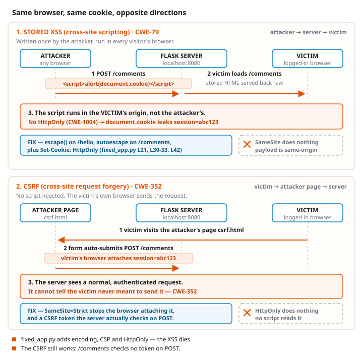
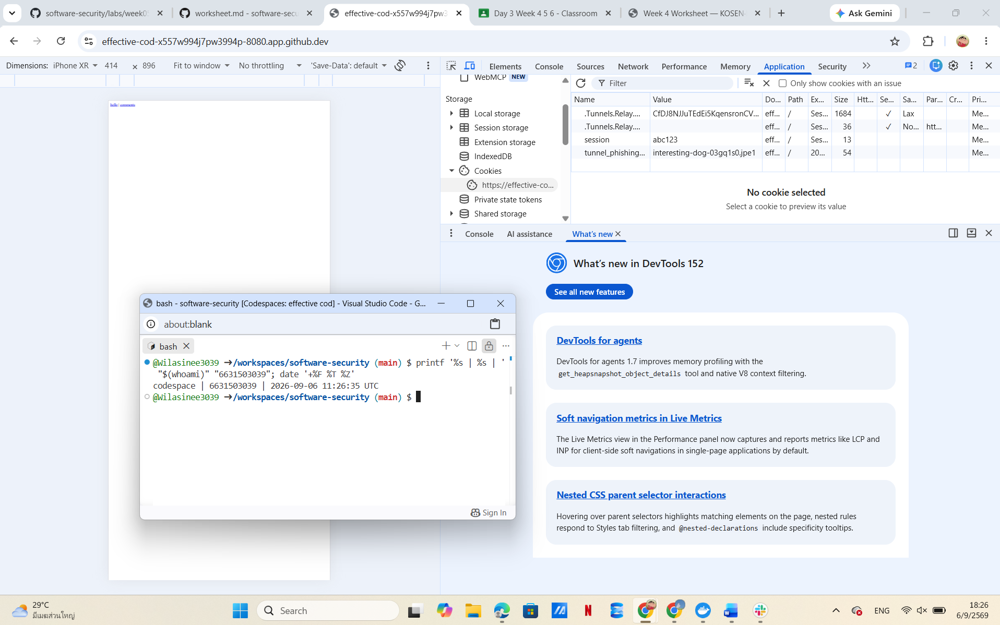
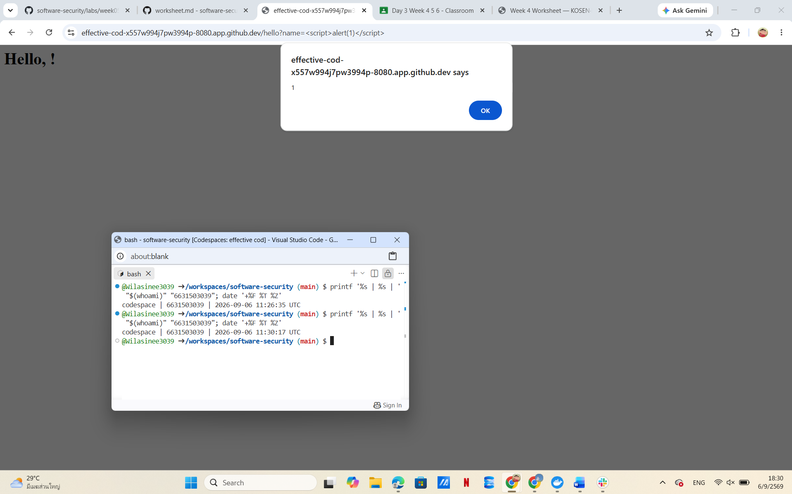
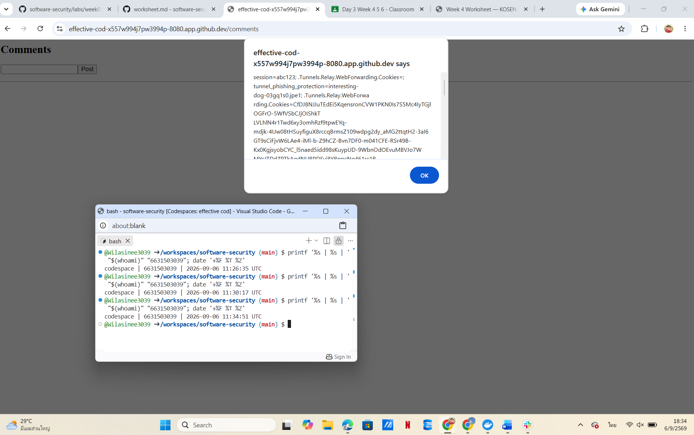
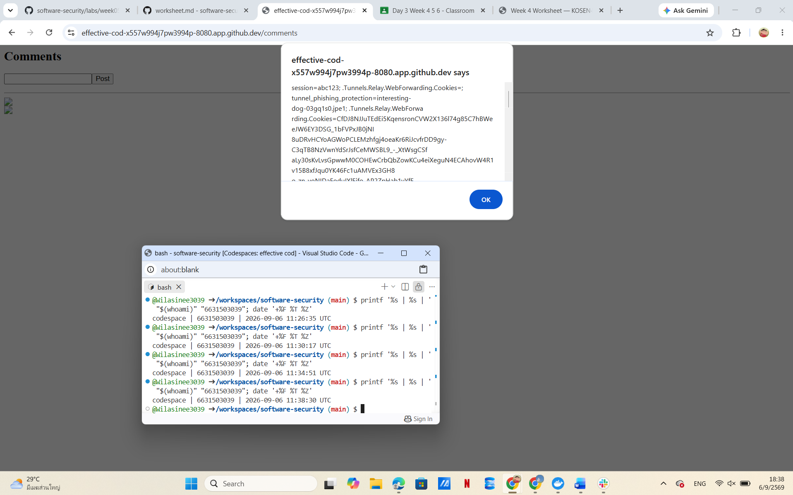
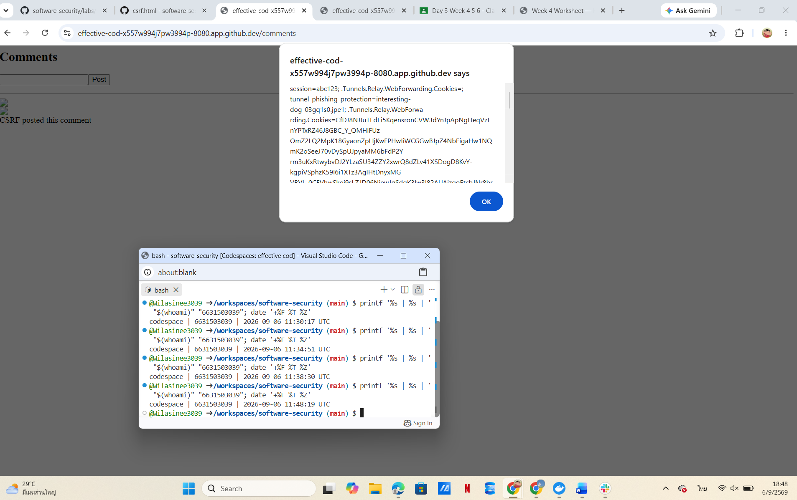
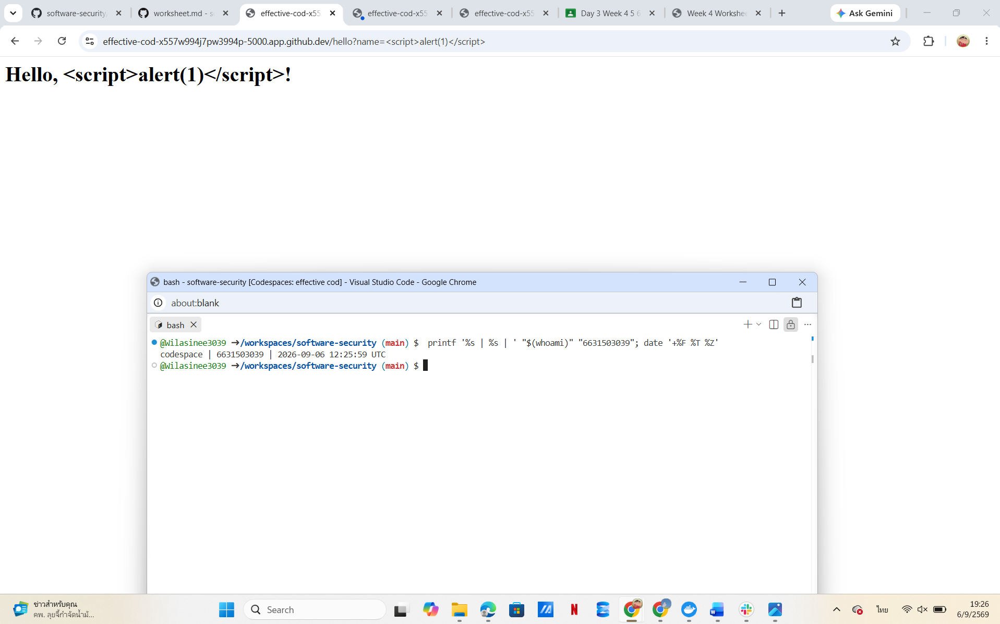

# Worksheet 5 — Cross-Site Scripting & Client-Side Risks (3 hrs)

> **Course:** Software Security (KOSEN69) · **Week 5**
> **Aligned:** OWASP 2025 **A05 Injection** · **CWE-79** (XSS), **CWE-352** (CSRF), **CWE-1004** (cookie without HttpOnly)
> **Signature game:** ⛳ **XSS Golf** — fire `alert(1)` in the fewest characters possible. Lower payload length = lower score = better. Par for reflected is the `` vector; can you go under par?

> ⚠️ **Ethics note:** Use only the provided `vulnerable_app.py` sandbox and your own Juice Shop container. Stealing real users' cookies or sessions is illegal. All "session theft" steps here target the sandbox cookie `session=abc123` only.

## Part 1 — Student Information

| Name | Student ID | Date | Group |
|------|-----------|------|-------|
|Wilasinee Mangkorn      |6631503039           |06/09/2026      |       |

```md
AI Use: Yes (used AI for explanation and review, then verified results in the lab environment)
```

## Part 2 — Lecture Questions

## 1. Distinguish reflected, stored, and DOM-based XSS by where the untrusted data is injected and when it executes. Which two does our vulnerable_app.py implement, and at which routes?

Reflected XSS occurs when untrusted user input is immediately reflected back into the web page without proper encoding. The malicious script is included in a request, such as a URL parameter, and executes when the victim opens that link. Stored XSS occurs when malicious input is saved on the server, such as in a comment database, and executes whenever users view the affected page. DOM-based XSS occurs when client-side JavaScript manipulates unsafe data from sources such as the URL and inserts it into the page.

The provided `vulnerable_app.py` implements two types of XSS. The `/hello` route is vulnerable to reflected XSS because it directly inserts the `name` parameter into HTML without escaping. The `/comments` route is vulnerable to stored XSS because user comments are stored and displayed as raw HTML without sanitization.


---

## 2. How does contextual output encoding (`markupsafe.escape`) stop `<script>` from executing? Why is HTML-context encoding different from JavaScript- or URL-context encoding?

Contextual output encoding converts special characters such as `<`, `>`, and `&` into safe HTML entities. For example, `<script>` becomes `&lt;script&gt;`, so the browser displays it as text instead of interpreting it as executable JavaScript.

HTML-context encoding is designed to protect data inserted into HTML content. However, JavaScript contexts and URL contexts have different parsing rules, so they require different types of encoding. Using the wrong encoding method may still allow attackers to break out of the intended context and execute malicious code.


---

## 3. Explain how a strict Content-Security-Policy (`script-src 'self'`) defeats an injected inline script even when encoding is missing.

A strict Content-Security-Policy (CSP) controls which sources are allowed to execute JavaScript. The directive `script-src 'self'` allows scripts only from the same origin and blocks inline scripts injected by attackers, such as `<script>alert(1)</script>`.

CSP provides an additional layer of defense because it can reduce the impact of XSS attacks even if another security control fails. However, CSP should not replace proper output encoding because encoding is the primary method for preventing injection.


---

## 4. What do the cookie flags HttpOnly, SameSite, and Secure each protect against? Map each to a concrete attack.

`HttpOnly` prevents JavaScript from accessing cookies through `document.cookie`. It helps protect against cookie theft through XSS attacks because injected scripts cannot read session cookies.

`SameSite` controls whether cookies are sent with cross-site requests. Setting `SameSite=Strict` helps reduce CSRF attacks because browsers will not attach the cookie when requests originate from another site.

`Secure` ensures cookies are only transmitted over HTTPS connections. It protects against attackers attempting to capture cookies through insecure network communication.


---

## 5. Why does CSRF work even without any script injection, and how does `SameSite=Strict` plus the same-origin policy blunt it?

CSRF works because browsers automatically attach cookies to requests sent to a website, even when the request is triggered from another website. An attacker can create a malicious page that submits a request to a vulnerable website, causing the victim's browser to perform an action using the victim's session.

The same-origin policy prevents websites from directly reading data from another origin, while `SameSite=Strict` prevents cookies from being attached to many cross-site requests. Together, these mechanisms reduce the ability of attackers to perform unauthorized actions using a victim's session.

## Part 3 — Hands-on Lab (150 min)



**Learning goals:** land reflected + stored XSS, abuse a JS-readable cookie, build a CSRF PoC against the comment board, then prove `fixed_app.py` blocks all of it.

**Prerequisites:** Docker + Docker Compose, a browser with DevTools, a text editor. Working dir: `labs/week05-xss-client-side/`.

### Environment setup

```bash
cd labs/week05-xss-client-side
docker compose up            # python:3.12-slim + flask, runs vulnerable_app.py
# vulnerable app -> http://localhost:8080   (service name: xss-lab, port 8080)
```
Optional secondary target (for DOM XSS, which our app does not expose):
```bash
docker run --rm -p 3000:3000 bkimminich/juice-shop       # -> http://localhost:3000
```

**What to submit per task:** the exact **payload**, a **screenshot** of the alert/effect, and a **2–3 sentence mitigation**.

---

**Task 0 — Onboarding (5 min).** Browse `http://localhost:8080/`. Open DevTools → Application → Cookies and confirm `session=abc123` is set with **no HttpOnly / SameSite**. Screenshot it. *Deliverable: screenshot.*
The cookie does not contain security attributes such as HttpOnly, SameSite, and Secure.

Because HttpOnly is missing, JavaScript executed through XSS can access the cookie using `document.cookie`. The missing SameSite attribute also allows the cookie to be attached to cross-site requests, increasing CSRF risk.

**Result**


**Task 1 — Reflected XSS + XSS Golf (30 min) ⛳.**
- *Goal:* execute JS via `/hello`, then minimize the payload.
- *Steps:* visit `/hello?name=<script>alert(1)</script>`, then the alternate `/hello?name=` (useful when `<script>` tags specifically are filtered — note it's actually 3 characters longer, not shorter). Record each payload's character count for your golf score.
- *Deliverable:* both payloads + char counts + screenshot of `alert(1)` + your lowest score.
**Payload 1**

Payload:
```html
<script>alert(1)</script>
```
URL:

https://effective-cod-x557w994j7pw3994p-8080.app.github.dev/hello?name=%3Cscript%3Ealert(1)%3C/script%3E

Character count:

29 characters

Result:

The payload executed successfully and displayed an alert(1) popup. This happened because the application directly inserted the user-controlled name parameter into HTML without applying output encoding.

**Screenshot:**


**Task 2 — Stored XSS (30 min) ⛳.**
- *Goal:* persist a script that runs for every visitor of `/comments`.
- *Steps:* POST a comment with body `<script>alert(document.cookie)</script>` (use the form or `curl -d 'body=...'`). Reload `/comments` and watch the cookie pop.
- *Deliverable:* payload + screenshot of the alert showing `session=abc123` + why stored XSS is more dangerous than reflected.
**Payload**

```html
<script>alert(document.cookie)</script>
```
**Result:**

The payload was stored in the comment board and executed when the /comments page was loaded.

The JavaScript successfully accessed the browser cookie and displayed:

session=abc123

**Screenshot:**


**Task 3 — Cookie theft via XSS (25 min).**
- *Goal:* show the cookie is readable by injected JS because **HttpOnly is missing** (CWE-1004).
- *Steps:* store `<script>new Image().src='http://localhost:8080/hello?name='+document.cookie</script>` (a beacon), or simply ``. Observe the cookie value being exfiltrated/displayed.
- *Deliverable:* payload + screenshot + 2–3 sentences on how HttpOnly would have stopped this.
**Payload**

```html

```
**Result:**

The injected JavaScript successfully accessed the browser cookie because the session cookie was not protected with the HttpOnly flag.

The alert displayed:

session=abc123

**Screenshot:**


**Task 4 — CSRF PoC (30 min).**
- *Goal:* make a third-party page force a state-changing POST to `/comments`.
- *Steps:* create a local `csrf.html` with an auto-submitting form targeting the board (no token exists, cookie has no SameSite, so the browser attaches `session` cross-site):
**csrf.html**

```html
<body onload="document.forms[0].submit()">

<form action="https://effective-cod-x557w994j7pw3994p-8080.app.github.dev/comments" method="POST">

<input name="body" value="CSRF posted this comment">

</form>

</body>
  ```
**Result:**

The CSRF page automatically submitted a POST request to the vulnerable /comments endpoint.

**The comment:***

CSRF posted this comment

was added successfully without manually submitting the form from the target website.

**Screenshot:**


**Why CSRF works**

CSRF works because browsers automatically attach cookies to requests sent to the target website. The vulnerable application does not verify whether the request was intentionally created by the user.


**Task 5 — Defend / fix it (30 min) 🛡️.**
- *Goal:* prove `fixed_app.py` blocks Tasks 1–3, then show that Task 4's CSRF PoC still gets through and explain why.

**1. Reflected XSS Fix**

I tested the same payload:

```html
<script>alert(1)</script>
```

on the /hello endpoint.

Before fixing, the payload executed JavaScript and showed an alert popup. After using fixed_app.py, the payload was displayed as plain text:

Hello, <script>alert(1)</script>!

**No JavaScript execution occurred.**

The vulnerability was fixed by applying contextual output encoding using markupsafe.escape().

Example:

```python
html = "<h1>Hello, " + str(escape(name)) + "!</h1>"
```

The special characters < and > are converted into safe HTML entities, preventing the browser from interpreting the input as JavaScript.

**Screenshot:**



**2. Stored XSS Fix**

I tested stored XSS using:

```<script>alert(1)</script>```

in the /comments page.

After the fix, the payload was displayed as text instead of executing JavaScript.

The vulnerability was fixed by using Jinja2 autoescaping when rendering stored comments:

```
<div class=comment>{{ c }}</div>

```

Jinja automatically escapes untrusted user input before rendering it in HTML.

**Screenshot:**


**3. Content Security Policy (CSP)**

The application adds a strict Content Security Policy header:

Content-Security-Policy:
default-src 'self'; script-src 'self'; object-src 'none'

This policy restricts script execution sources and blocks injected inline scripts.

**Screenshot:**


**4. Cookie Security**

The session cookie was hardened by adding:

```resp.set_cookie(
    "session",
    "abc123",
    httponly=True,
    samesite="Strict",
    secure=True
)
```

**Security improvements:**

HttpOnly prevents JavaScript from reading cookies using document.cookie.
SameSite=Strict reduces CSRF attacks by preventing cookies from being sent in cross-site requests.
Secure ensures cookies are sent only over HTTPS connections.

**Screenshot:**


### Conclusion

The fixed application successfully prevented XSS attacks by using output encoding, Jinja autoescaping, CSP, and secure cookie attributes.

However, the CSRF PoC was still successful because the `/comments` endpoint did not implement CSRF token validation or server-side request verification. Cookie hardening reduces the risk but does not completely prevent CSRF without additional protection.


## Part 4 — Reflection

### 1. CWE/OWASP mapping

The reflected XSS and stored XSS vulnerabilities in this lab are mapped to **CWE-79 (Improper Neutralization of Input During Web Page Generation)** because user-controlled input was inserted into HTML without proper escaping. The CSRF proof-of-concept is mapped to **CWE-352 (Cross-Site Request Forgery)** because an attacker can force a user's browser to send unauthorized requests. Both issues are related to OWASP 2025 **A05 Injection**, where untrusted input or requests are not properly handled.

---

### 2. Real breach

The 2018 British Airways breach involved malicious JavaScript being injected into the website through a client-side script injection attack. The injected script collected payment information from users during the checkout process, similar to how XSS can execute unauthorized JavaScript in this lab. This incident shows that client-side attacks can cause serious data leakage even without compromising the main server. Using proper output encoding and a strong Content Security Policy (CSP) can reduce the risk of script injection attacks.

---

### 3. Best mitigation

Among output encoding, strict CSP, and HttpOnly+SameSite cookies, the best defense is a **defense-in-depth approach using all of them together**. Output encoding is the primary protection because it prevents malicious input from being interpreted as HTML or JavaScript. However, encoding alone is still risky because it depends on applying the correct context and may not protect against every type of client-side attack. A strict CSP provides an additional layer by limiting script execution, while HttpOnly and SameSite cookies reduce the impact of XSS and CSRF attacks.

## Grading rubric (100)

| Criterion | Points |
|-----------|-------:|
| Part 2 — Lecture questions (conceptual accuracy) | 20 |
| Part 3 — Exploitation + evidence (payloads + screenshots, Tasks 1–4) | 40 |
| Part 3 — Defense (Task 5: fixes proven, lines cited) | 25 |
| Part 4 — Reflection (CWE/OWASP mapping, breach, mitigation) | 15 |
| **Total** | **100** |

---

## Evidence & Integrity (required)

- **Identity proof:** every screenshot/diagram must show a terminal running `printf '%s | %s | ' "$(whoami)" '<YOUR-STUDENT-ID>'; date '+%F %T %Z'` **in the
  same image as the evidence**. When the evidence is a browser page, a DevTools panel or a
  rendered response, put that terminal **beside the browser and capture the whole screen** — a
  cropped window carries nothing that identifies you, and the lab's own output is
  byte-identical for the whole cohort *by design*, so the stamp is the only thing that makes
  the shot yours. Generic or borrowed evidence is not accepted.
- **Personalized flag (if this lab issues one):** N/A
  *Flags are unique per student — submitting another student's flag is a violation. How to submit: **learn.zcr.ai/submit** (full guide: `SUBMISSION.md` in the repo root).*
- ### Explain in your own words

#### 1. What did you do, and why did the vulnerability work?

In this lab, I tested reflected XSS, stored XSS, cookie theft, and CSRF attacks. The vulnerabilities worked because the application did not properly validate or protect user input. User data was inserted into HTML without escaping, allowing the browser to execute injected scripts. The cookie theft worked because the session cookie did not have the HttpOnly flag, and CSRF worked because the application did not verify the source of POST requests.

---

#### 2. Why does your fix actually stop it, and what could still break it?

The fix prevents XSS by using output encoding with `escape()` and Jinja autoescaping, which prevents the browser from executing injected scripts. CSP and secure cookie settings (`HttpOnly`, `SameSite`, and `Secure`) provide additional protection against script execution, cookie theft, and CSRF.

However, security can still fail if developers use incorrect encoding, allow unsafe HTML, or configure security policies incorrectly. Therefore, multiple security controls should be used together for defense-in-depth.

---

## 🤖 Audit the AI (required)

AI is a power tool you must **distrust** — you are graded on your *critique*, not the AI's answer.

1. Ask an AI assistant to exploit **or** fix this week's vulnerability. Paste its full answer.
I asked an AI assistant to fix the XSS vulnerability in this lab.

AI answer:

"To fix XSS, remove all user input containing `<script>` tags before displaying it. You can use a blacklist filter to block dangerous words such as `script`, `alert`, and `javascript`. Adding CSP headers will completely prevent XSS attacks."

---
2. **Find what's wrong or risky** in it — insecure code, a subtly incomplete fix, a hallucinated API/function/CVE, a missed edge case, or wrong reasoning. Quote the exact line(s).
The AI answer is incomplete and contains unsafe recommendations.

The statement:

> "remove all user input containing `<script>` tags"

is risky because blacklist filtering can be bypassed by using other HTML elements or event handlers, such as ``. Blocking only specific keywords does not provide complete XSS protection.

The statement:

> "Adding CSP headers will completely prevent XSS attacks"

is also incorrect because CSP is an additional security layer, not a replacement for proper output encoding. The primary defense should be contextual output encoding and safe handling of user input.

---
3. Produce the **correct, verified** version yourself and explain in 2–3 sentences why the AI's output was insufficient.

> Disclose your AI use in the Part 1 table. This task counts toward your **Defense + Reflection** score.

The correct fix is to apply contextual output encoding using `markupsafe.escape()` for reflected XSS and enable Jinja2 autoescaping for stored content. Additional protection can be added using CSP and secure cookie settings such as HttpOnly and SameSite.

The AI answer was insufficient because it suggested blacklist filtering and overstated the protection of CSP. These approaches do not fully prevent XSS, while proper output encoding prevents the browser from interpreting user input as executable code.

---

## 🧠 Comprehension & Prompt

### A. Explain in Plain English (EiPE)

The vulnerable application accepts user input from the URL and comment form, then displays that input directly on the webpage. Because the application does not properly protect or escape the input, the browser treats the injected script as real code and executes it. This allows attackers to run JavaScript and access sensitive information such as cookies.

---

### B. Prompt Problem

#### Final Prompt

Fix the reflected and stored XSS vulnerability in this Flask application. Apply a secure solution following web security best practices. Do not use blacklist filtering. Use contextual output encoding, safe template rendering, and explain why the fix prevents the exploit. Also verify that the payload `<script>alert(1)</script>` no longer executes after the fix.

---

### Verified Result

After applying the fix, the payload:

```html
<script>alert(1)</script>
```
no longer executed.

The reflected XSS payload was displayed as plain text because markupsafe.escape() encoded dangerous HTML characters. The stored XSS payload was also rendered as text because Jinja2 autoescaping was enabled.

The exploit failed after the fix, confirming that the security changes successfully prevented script execution.
