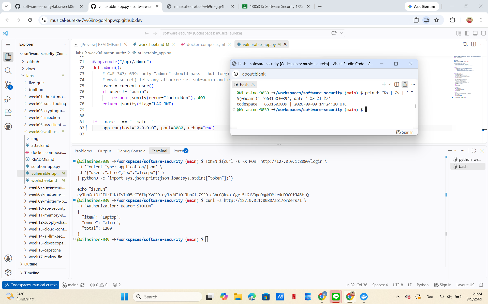
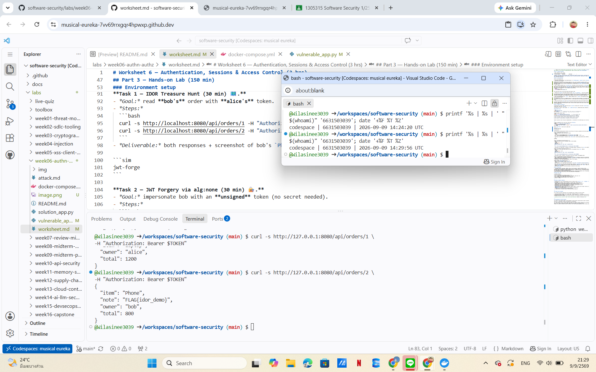
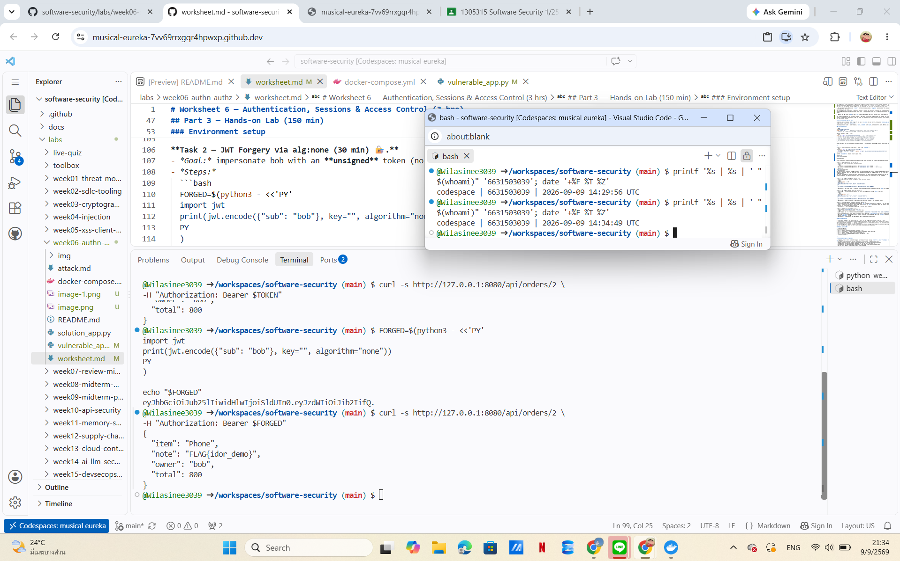
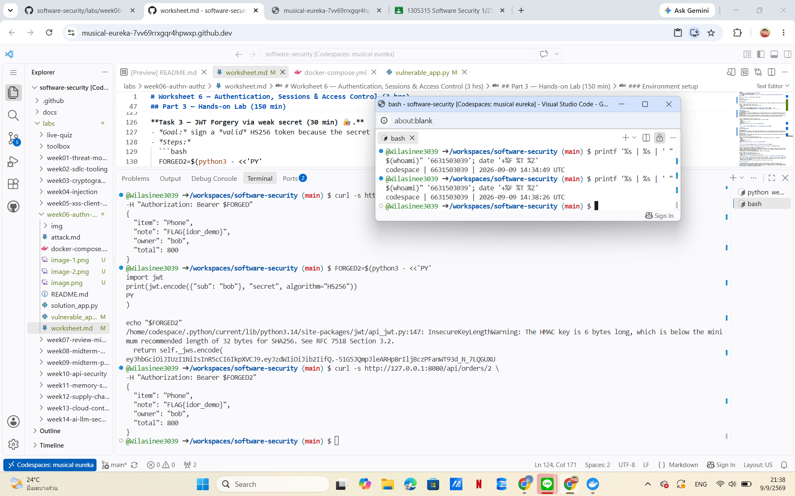
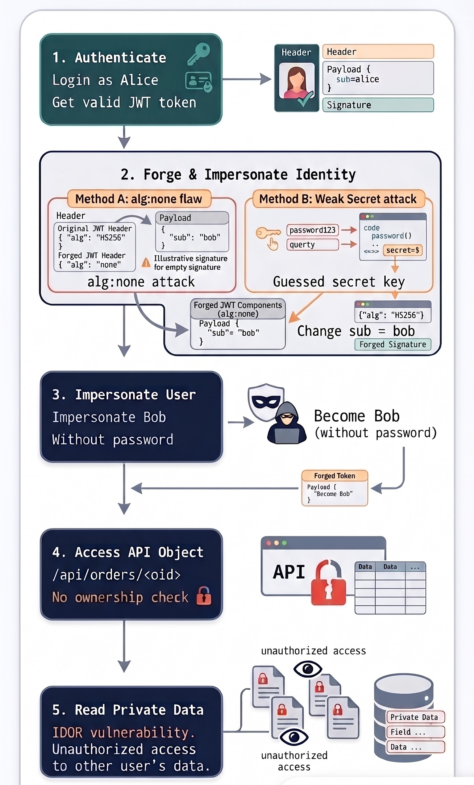
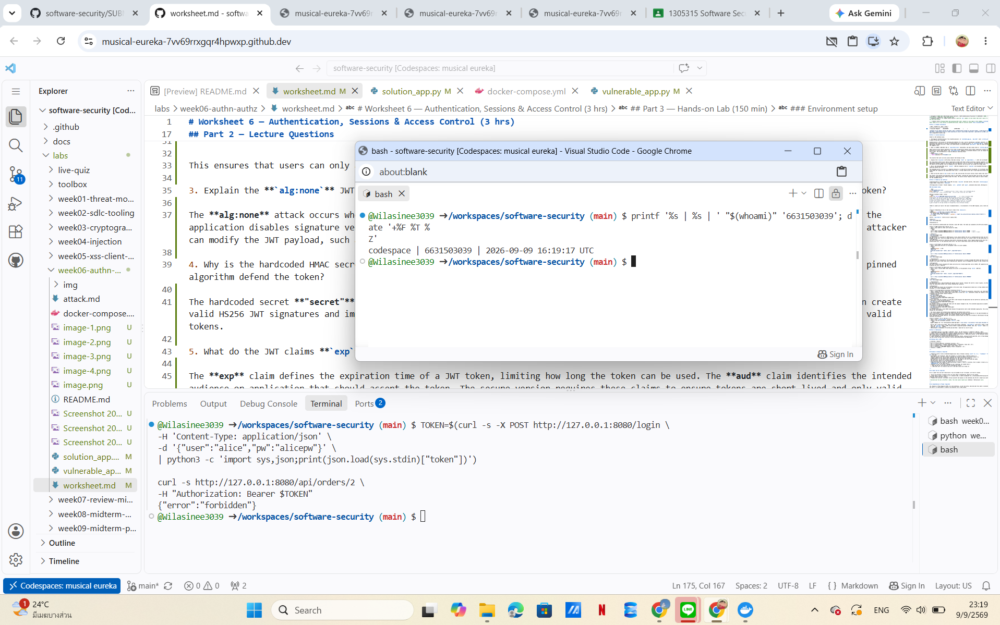

# Worksheet 6 — Authentication, Sessions & Access Control (3 hrs)

> **Course:** Software Security (KOSEN69) · **Week 6**
> **Aligned:** OWASP 2025 **A01 Broken Access Control**, **A07 Authentication Failures** · **CWE-639** (IDOR), **CWE-347** (improper signature verification), **CWE-321** (weak hardcoded key)
> **Signature games:** 🗺️ **IDOR Treasure Hunt** — walk the `oid` numbers to loot orders that aren't yours · 🔏 **JWT Forgery** — mint a token you were never given.

> ⚠️ **Ethics note:** Forging tokens and accessing other users' objects is only legal in this sandbox (`vulnerable_app.py`) and your own Juice Shop. Doing it to a real service is unauthorized access. Keep all activity inside `http://localhost:8080`.

## Part 1 — Student Information

| Name | Student ID | Date | Group |
|------|-----------|------|-------|
| Wilasinee Mangkorn     |6631503039           |09/09/2026      |       |

**AI Usage Disclosure:**
I use AI to help understand vulnerabilities, review security concepts, and improve the quality of explanations.


## Part 2 — Lecture Questions

Answer in 2–4 sentences each.

1. Distinguish **authentication** from **authorization**. In `vulnerable_app.py`, `get_order` calls `current_user()` but ignores its result (L63) — which of the two is missing?

Authentication is the process of verifying the identity of a user, such as validating a username, password, or JWT token. Authorization determines what resources or actions an authenticated user is allowed to access. In `vulnerable_app.py`, authentication exists because the application validates the user's token, but authorization is missing because `get_order()` does not check whether the requested order belongs to the logged-in user.

2. What is **IDOR** (CWE-639)? Why is `/api/orders/<oid>` exploitable, and what single check in `solution_app.py` (L64) closes it?

IDOR (Insecure Direct Object Reference) occurs when an application exposes direct object identifiers without verifying whether the user has permission to access those objects. The `/api/orders/<oid>` endpoint is vulnerable because a user can change the order ID and access another user's order. The vulnerability is fixed by adding an ownership check:
```python
if order["owner"] != user:
    return jsonify(error="forbidden"),403
```

This ensures that users can only access objects that belong to them.

3. Explain the **`alg:none`** JWT attack. Why does listing `"none"` in `algorithms=[...]` (L55) let an attacker submit an *unsigned* token?

The **alg:none** attack occurs when an application accepts JWT tokens without verifying a digital signature. In **vulnerable_app.py,** the application disables signature verification when the algorithm is set to **"none"**, allowing attackers to create unsigned tokens. The attacker can modify the JWT payload, such as changing the user identity, and the server will accept the forged token.

4. Why is the hardcoded HMAC secret `"secret"` (CWE-321) dangerous even if `alg:none` were disabled? How does a strong random secret + pinned algorithm defend the token?

The hardcoded secret **"secret"** is dangerous because it is weak and can easily be guessed. If an attacker knows this secret, they can create valid HS256 JWT signatures and impersonate other users. A strong random secret and a fixed algorithm prevent attackers from generating valid tokens.

5. What do the JWT claims **`exp`** and **`aud`** add, and why does the secure version reject tokens that lack them?

The **exp** claim defines the expiration time of a JWT token, limiting how long the token can be used. The **aud** claim identifies the intended audience or application that should accept the token. The secure version requires these claims to ensure tokens are short-lived and only valid for the intended service.

## Part 3 — Hands-on Lab (150 min)

**Learning goals:** exploit IDOR, forge JWTs two ways (`alg:none` and weak secret), then prove `solution_app.py` enforces ownership and rejects forged tokens. Steps mirror `attack.md`.

**Prerequisites:** Docker + Docker Compose, `curl`, `python3` with `pyjwt`, optionally Burp Suite. Working dir: `labs/week06-authn-authz/`.

### Environment setup

```bash
cd labs/week06-authn-authz
docker compose up            # python:3.12-slim + flask + pyjwt, runs vulnerable_app.py
# vulnerable app -> http://localhost:8080   (service name: authz-lab, port 8080)
```
Optional secondary target / proxy:
```bash
docker run --rm -p 3000:3000 bkimminich/juice-shop       # -> http://localhost:3000
# Burp Suite: put the proxy listener AND the browser proxy on 127.0.0.1:8081.
# NOT 8080 — the lab app already owns host 8080 (docker-compose.yml, "8080:5000").
# Burp's own default listener is 8080, so you must change it: leave it there and
# either the listener refuses to start ("Address already in use") or, if it does
# bind, the browser's proxy address is the target's address and every request
# goes straight to the app instead of through Burp — you intercept nothing.
```

**What to submit per task:** the exact **command/token**, a **screenshot** of the JSON response, and a **2–3 sentence mitigation**.

---

**Task 0 — Onboarding (5 min).** Get alice's token (from `attack.md`):
```bash
TOKEN=$(curl -s -X POST http://localhost:8080/login \
  -H 'Content-Type: application/json' \
  -d '{"user":"alice","pw":"alicepw"}' | python3 -c 'import sys,json;print(json.load(sys.stdin)["token"])')
echo "$TOKEN"
```
Confirm `/api/orders/1` returns alice's Laptop order. 

**Result:** 


**Explanation:**

Alice successfully authenticated and received a valid JWT token. The token was accepted by the API and allowed access to Alice's own order.

**Task 1 — IDOR Treasure Hunt (30 min) 🗺️.**
- *Goal:* read **bob's** order with **alice's** token.
- *Steps:*
  ```bash
  curl -s http://localhost:8080/api/orders/1 -H "Authorization: Bearer $TOKEN"   # yours
  curl -s http://localhost:8080/api/orders/2 -H "Authorization: Bearer $TOKEN"   # bob's — leaks!
  ```
- **Result:** 

- **Explanation**
The application is vulnerable to IDOR because it only checks whether the user is authenticated but does not verify whether the requested order belongs to that user. Alice can change the order ID from her own order (1) to Bob's order (2) and access Bob's private data.
- **Mitigation**
The server should perform an ownership check before returning any object. Every request should verify that the requested resource belongs to the authenticated user. If the ownership check fails, the server should deny access with HTTP 403 Forbidden.


**Task 2 — JWT Forgery via alg:none (30 min) 🔏.**
- *Goal:* impersonate bob with an **unsigned** token (no secret needed).
- *Steps:*
  ```bash
  FORGED=$(python3 - <<'PY'
  import jwt
  print(jwt.encode({"sub": "bob"}, key="", algorithm="none"))
  PY
  )
  curl -s http://localhost:8080/api/orders/2 -H "Authorization: Bearer $FORGED"
  ```
- **Result:**


- **Explanation**
The application is vulnerable to the alg:none JWT attack because it accepts unsigned JWT tokens and does not properly verify the signature. An attacker can create a fake token with a modified user identity, such as changing the subject to bob, without knowing the secret key.

- **Mitigation**
The server should reject unsigned JWT tokens and allow only trusted algorithms such as HS256. JWT signatures must always be verified before accepting the user's identity.

**Task 3 — JWT Forgery via weak secret (30 min) 🔏.**
- *Goal:* sign a *valid* HS256 token because the secret is the guessable string `secret` (CWE-321).
- *Steps:*
  ```bash
  FORGED2=$(python3 - <<'PY'
  import jwt
  print(jwt.encode({"sub": "bob"}, "secret", algorithm="HS256"))
  PY
  )
  curl -s http://localhost:8080/api/orders/2 -H "Authorization: Bearer $FORGED2"
  ```
- **Result:**


- **Explanation**
The application uses a weak hardcoded JWT signing secret "secret". Because the secret is easy to guess, an attacker can create a valid HS256 token and impersonate another user without knowing their password.

- **Mitigation**
The JWT signing key should not be hardcoded in the source code. The application should use a strong random secret stored securely in environment variables or a secret management system.

**Task 4 — Privilege/identity escalation reasoning (25 min).**
- *Goal:* combine the flaws. Using Task 2/3 you became `bob` *without his password*; using Task 1 you read objects you don't own.
- *Steps:* document the full attack chain (forge token → access any `oid`). Optionally replay the requests through **Burp Suite Repeater** and screenshot the intercepted request/response.

- **Attack Chain**


- **Evidence 1 — IDOR Attack**

- **Explanation**
Alice's valid token was accepted to access Bob's order because the application did not perform an ownership check.
- **Evidence 2 — JWT alg:none Forgery**

- **Explanation**
The attacker created an unsigned JWT token with the subject changed to bob. The vulnerable application accepted the token because signature verification was improperly handled.
- **Evidence 3 — Weak Secret Forgery**

- **Explanation**
The attacker generated a valid HS256 token because the application used a weak hardcoded signing key. This allowed user impersonation without knowing the real password.

- The attack combines JWT authentication weaknesses and broken access control. 
First, the attacker creates a forged JWT token using either the alg:none vulnerability or the weak hardcoded secret. 
The attacker can impersonate another user without knowing the user's password. 
After obtaining the forged identity, the attacker accesses object IDs that do not belong to them because the application does not perform ownership verification.

**Task 5 — Defend / fix it (30 min) 🛡️.**
- *Goal:* prove `solution_app.py` blocks Tasks 1–3.
- *Steps:* stop the vulnerable container (`Ctrl-C`), then:
  ```bash
  docker compose run --rm --service-ports authz-lab bash -c "pip install --no-cache-dir flask pyjwt && python solution_app.py"
  ```
  Re-run: get a fresh alice token, then re-fire each attack. Expected: `/api/orders/2` with alice's token → **403 forbidden** (ownership check, L64); the `alg:none` token → **401 invalid token** (algorithm pinned to HS256, L50); the `"secret"` token → **401** (strong random secret + required `aud`/`exp`, L10/40).
- **Test 1 — IDOR Protection** 
**Command**
 ```TOKEN=$(curl -s -X POST http://127.0.0.1:8080/login \
-H 'Content-Type: application/json' \
-d '{"user":"alice","pw":"alicepw"}' \
| python3 -c 'import sys,json;print(json.load(sys.stdin)["token"])')

curl -s http://127.0.0.1:8080/api/orders/2 \
-H "Authorization: Bearer $TOKEN"
 ```
 **Result**


**Out put**
 ```
{"error":"forbidden"}
```

**Fix line**
 ```
if order["owner"] != user:
    return jsonify(error="forbidden"),403
 ```
**Explanation**

The secure version performs a server-side ownership check before returning order information. Users can no longer access objects that do not belong to them.

- **Test 2 — alg:none Protection** 
**Command**
 ```FORGED=$(python3 - <<'PY'
import jwt
print(jwt.encode({"sub":"bob"}, key="", algorithm="none"))
PY
)

echo "$FORGED"

curl -s http://127.0.0.1:8080/api/orders/2 \
-H "Authorization: Bearer $FORGED"
 ```
 **Result**


**Out put**
 ```
{
  "error": "invalid token"
}
```

**Fix line**
 ```
data = jwt.decode(
    token,
    SECRET,
    algorithms=["HS256"],
    audience=AUDIENCE,
    options={"require": ["exp", "aud"]}
)
 ```
**Explanation**

The vulnerable version allowed unsigned JWT tokens using alg:none.
The fixed version restricts accepted algorithms to HS256 and verifies the signature, so attackers cannot create accepted unsigned tokens.

- **Test 3 — Weak Secret Protection** 
**Command**
 ```bash
FORGED2=$(python3 - <<'PY'
import jwt
print(jwt.encode({"sub":"bob"}, "secret", algorithm="HS256"))
PY
)

echo "$FORGED2"

curl -s http://127.0.0.1:8080/api/orders/2 \
-H "Authorization: Bearer $FORGED2"
 ```
 **Result**


**Out put**
 ```
{
  "error": "invalid token"
}
```

**Fix line**
 ```
SECRET = os.environ.get("JWT_SECRET") or os.urandom(32).hex()
 ```
```
data = jwt.decode(
    token,
    SECRET,
    algorithms=["HS256"],
    audience=AUDIENCE,
    options={"require": ["exp", "aud"]}
)
 ```
**Explanation**

The vulnerable version used a weak hardcoded HMAC secret "secret", allowing attackers to generate a valid HS256 signature and forge JWT tokens without knowing the real user's password.

The fixed version replaces the predictable secret with a strong random secret and validates the JWT signature, algorithm, expiration time, and audience. Therefore, tokens created with the old weak secret are rejected.

**Overall Security Improvement Summary**

The vulnerable application failed in both authentication and authorization controls. 
The fixed version applies server-side authorization checks, restricts JWT algorithms, verifies token signatures, and uses a strong secret with required claims. These controls prevent attackers from accessing other users' resources or creating forged authentication tokens.

## Part 4 — Reflection

### 1. CWE/OWASP Mapping

The IDOR problem in this lab is related to **CWE-639** and **OWASP A01: Broken Access Control** because the system does not check if the user has permission to access that object. This allows a user to view another user's data by simply changing the object ID.

The JWT problems are related to **CWE-347** and **CWE-321** under **OWASP A07: Authentication Failures**. These happen because the application does not properly verify JWT tokens and uses a weak secret key, allowing attackers to create fake tokens.

---

### 2. Real Breach — 2022 Optus Breach

The 2022 Optus breach happened because an exposed API allowed attackers to access customer information without proper authorization checks. This is similar to Task 1 because the attacker could access data that should not belong to them by using identifiers. It is also related to Task 4 because combining authentication problems with missing access control can make the impact much worse. This shows why every request must be checked before giving access to sensitive data.

---

### 3. Best Mitigation

The most important protection in this case is the **deny-by-default ownership check** because the server should always check whether the user has permission to access the requested data. Even if an attacker gets a valid token or finds a way to bypass authentication, the ownership check can still stop them from accessing other users' information.

JWT algorithm checking and strong secret management are also important, but they only protect the login process. Authorization checks are still necessary because the server must verify what each user is allowed to access.

## Grading rubric (100)

| Criterion | Points |
|-----------|-------:|
| Part 2 — Lecture questions (conceptual accuracy) | 20 |
| Part 3 — Exploitation + evidence (payloads/tokens + screenshots, Tasks 1–4) | 40 |
| Part 3 — Defense (Task 5: fixes proven, lines cited) | 25 |
| Part 4 — Reflection (CWE/OWASP mapping, breach, mitigation) | 15 |
| **Total** | **100** |

---

## Evidence & Integrity (required)

- **Identity proof:** every screenshot/diagram must show a terminal running `printf '%s | %s | ' "$(whoami)" '<YOUR-STUDENT-ID>'; date '+%F %T %Z'` **in the
  same image as the evidence**. When the evidence is a browser page, a DevTools panel or a
  rendered response, put that terminal **beside the browser and capture the whole screen** — a
  cropped window carries nothing that identifies you, and the lab's own output is
  byte-identical for the whole cohort *by design*, so the stamp is the only thing that makes
  the shot yours. Generic or borrowed evidence is not accepted.
- **Personalized flag (if this lab issues one):** N/A
  *Flags are unique per student — submitting another student's flag is a violation. How to submit: **learn.zcr.ai/submit** (full guide: `SUBMISSION.md` in the repo root).*
- **Explain in your own words** *(graded on your reasoning, not copied text):*
  1. What did you do, and **why did the vulnerability work**?

In this test, I test three types of vulnerabilities: IDOR, JWT `alg:none`, and easily guessable JWT secrets. 

The IDOR vulnerability was successfully exploited because the application only verified whether the user was logged in, without checking if the specific object actually belonged to that user. The JWT attacks also succeeded because the application failed to properly validate the token signature and utilized a weak, guessable secret key.
  2. **Why does your fix actually stop it** — and what could still break it?
  Addressing this issue helps prevent such attacks by implementing ownership checks, validating JWT signatures, restricting allowed algorithms, and using strong secret keys. However, security risks may persist if developers fail to implement authorization checks for new endpoints or if the secret key is compromised.

---

## 🤖 Audit the AI (required)

AI is a power tool you must **distrust** — you are graded on your *critique*, not the AI's answer.

1. Ask an AI assistant to exploit **or** fix this week's vulnerability. Paste its full answer.

I asked an AI assistant:

"How can I fix the IDOR and JWT vulnerabilities in this Flask application?"

**AI response:**

```
@app.route("/api/orders/<int:oid>")
def get_order(oid):
    user = current_user()
    order = ORDERS.get(oid)

    if order:
        return jsonify(order)

    return jsonify(error="not found"), 404
```

**The AI also suggested:**
```
SECRET = "my_secret_key"

token = jwt.encode(
    {"sub": user},
    SECRET,
    algorithm="HS256"
)
```
2. **Find what's wrong or risky** in it — insecure code, a subtly incomplete fix, a hallucinated API/function/CVE, a missed edge case, or wrong reasoning. Quote the exact line(s).

The AI answer is incomplete and still has security problems.

First, the IDOR issue is not actually fixed. The code only checks whether the order exists:

```
if order:
    return jsonify(order)

```

but it does not check whether the order belongs to the current user. An attacker could still change the order ID and access another user's data.

Second, using:

```
SECRET = "my_secret_key"
```

is still a hardcoded secret. If the secret is leaked or guessed, attackers can create valid JWT tokens.

The AI answer also does not include important JWT protections such as:

- restricting allowed algorithms
-  verifying token audience
- requiring token expiration time


3. Produce the **correct, verified** version yourself and explain in 2–3 sentences why the AI's output was insufficient.

The correct fix should include server-side authorization and secure JWT handling.

SECRET = os.environ.get("JWT_SECRET") or os.urandom(32).hex()
```
data = jwt.decode(
    token,
    SECRET,
    algorithms=["HS256"],
    audience=AUDIENCE,
    options={"require": ["exp", "aud"]}
)


@app.route("/api/orders/<int:oid>")
def get_order(oid):
    user = current_user()

    order = ORDERS.get(oid)

    if not order:
        return jsonify(error="not found"), 404

    if order["owner"] != user:
        return jsonify(error="forbidden"), 403

    return jsonify(order)
```
The AI answer was insufficient because it fixed only part of the problem and did not enforce ownership checks or secure JWT verification. The verified version prevents unauthorized access by checking ownership and ensures that only properly signed and valid JWT tokens are accepted.

> Disclose your AI use in the Part 1 table. This task counts toward your **Defense + Reflection** score.

---

## 🧠 Comprehension & Prompt (required)

**A. Explain in Plain English (EiPE).** 
This vulnerable application allows users to log in and obtain a JWT token but fails to strictly verify whether the user has authorization to access specific data. Consequently, an attacker can modify the token or alter object ID values ​​to access another user's data. This issue arises because the application trusts user-supplied data without performing adequate server-side validation.

**B. Prompt Problem.** 
**Final Prompt**
You are a security engineer auditing a Flask application that contains two vulnerabilities:

An IDOR vulnerability in `/api/orders/<id>` where users can access other users' orders.

JWT security issues, including a weak secret key and improper token validation.

Please propose a secure solution that:

- Implements server-side ownership validation before returning the object.

- Prevents users from accessing resources they do not own.

- Uses a strong secret key sourced from environment variables.

- Accepts only trusted JWT algorithms.

- Validates the JWT signature, expiration (exp), and audience (aud).

- Explains how each change helps mitigate the vulnerabilities.

Do not remove authentication; please provide secure Flask/PyJWT code.

---

### Verified Result

After applying the secure fix, the previous attacks failed:

1. IDOR attack:

Request:
```
GET /api/orders/2
```
using Alice's token returned:

```json
{
  "error": "forbidden"
}
```
JWT alg:none attack returned:
```
{
  "error": "invalid token"
}
```
Weak secret JWT attack using "secret" returned:
```
{
  "error": "invalid token"
}
```
The result shows that the secure implementation successfully prevents unauthorized access and forged JWT tokens.

**Explanation**

The initial AI-generated solution was insufficient simply adding an authentication system without securely verifying ownership or validating the JWT token was not enough. However, the comprehensive prompt clearly specified the security requirements, and the resulting solution was verified through repeated attack testing against the patched application.